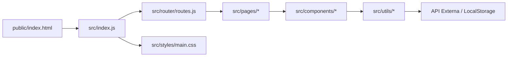

# Arquitectura de CaletaJS

CaletaJS es una Single Page Application (SPA) de alto rendimiento para el seguimiento simulado de inversiones en criptomonedas, construida sin frameworks usando JavaScript vainilla (ES6+) y Tailwind CSS v4.

## Diagrama de Módulos



## Stack Tecnológico

| Capa | Tecnología | Propósito |
|---|---|---|
| **Lenguaje** | JavaScript (ES6+) | Lógica de la aplicación. Se aplica un enfoque de "Strict Type" implícito mediante JSDoc y chequeo de tipos. |
| **Bundler** | Webpack 5 + Babel | Empaquetado, Hot Module Replacement (HMR), y transpilación. |
| **Estilos** | Tailwind CSS v4 + PostCSS | Sistema de diseño utility-first. |
| **Enrutamiento**| Custom Hash Router | Navegación SPA basada en `#/ruta`. |
| **Componentes** | Template Literals | Funciones puras que retornan strings HTML. |
| **Dependencias**| pnpm (10.x) | Gestión de paquetes (estricto). |

## Estructura de Archivos

```text
caleta/
├── public/                 # Archivos estáticos, punto de entrada (index.html)
├── src/
│   ├── assets/             # Imágenes y SVGs (sprite.svg)
│   ├── components/         # Piezas UI reutilizables (Header, HoldingsTable)
│   ├── pages/              # Vistas completas asociadas a las rutas
│   ├── router/             # Lógica de enrutamiento basada en hashes
│   ├── styles/             # Archivos CSS globales y directivas Tailwind
│   ├── utils/              # Funciones puras, helpers, API calls
│   └── index.js            # Punto de entrada principal JS
├── webpack.config.js       # Configuración del bundler
└── package.json            # Dependencias y scripts
```

## Mapa de Documentación

| Tema | Enlace |
|---|---|
| Índice de Arquitectura | [README.md](./README.md) |
| Patrones de Diseño | [patrones.md](./patrones.md) |
| Flujo de Datos | [flujo-de-datos.md](./flujo-de-datos.md) |
| Sistema de Diseño | [sistema-de-diseno.md](./sistema-de-diseno.md) |
| Accesibilidad | [accesibilidad.md](./accesibilidad.md) |
| SEO | [seo.md](./seo.md) |
| Testing | [testing.md](./testing.md) |
| Desarrollo Local | [../runbooks/desarrollo-local.md](../runbooks/desarrollo-local.md) |
| Agregar Ruta | [../runbooks/agregar-ruta.md](../runbooks/agregar-ruta.md) |
| Troubleshooting | [../runbooks/troubleshooting.md](../runbooks/troubleshooting.md) |
| Deploy | [../runbooks/deploy.md](../runbooks/deploy.md) |
| Decisiones (ADRs) | [../decisions/](../decisions/) |

---
*Última actualización: 2026-04-26*
