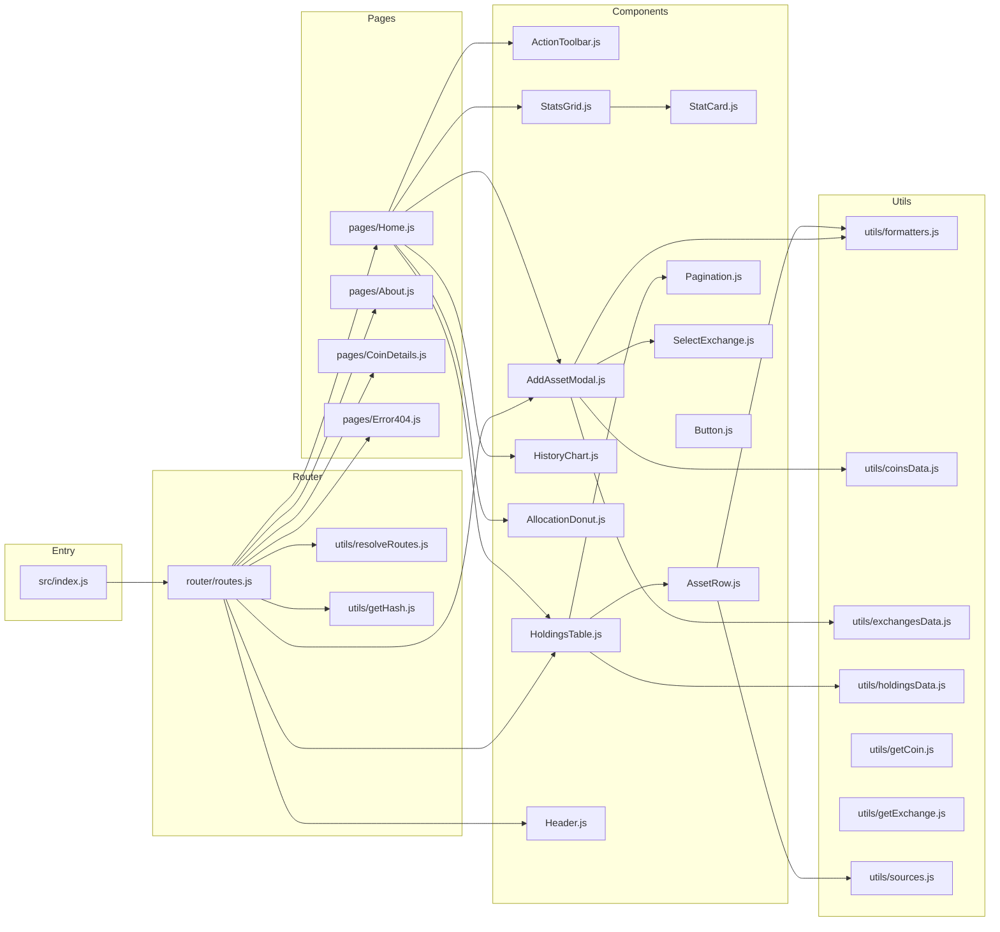

# Arquitectura — Índice

**CaletaJS** es una Single Page Application (SPA) de alto rendimiento para el seguimiento simulado de inversiones en criptomonedas. Construida con JavaScript Vanilla y Webpack 5 para maximizar la velocidad y minimizar el tamaño del bundle.

---

## Grafo de dependencias de módulos



---

## Stack Tecnológico

| Capa            | Tecnología             | Propósito                                    |
|-----------------|------------------------|----------------------------------------------|
| Lenguaje        | JavaScript ES6+        | Lógica de la aplicación                     |
| Empaquetador    | Webpack 5              | Bundle, HMR, optimización de assets         |
| Transpilador    | Babel                  | Compatibilidad de sintaxis ES6+             |
| Estilos         | Tailwind CSS v4        | Utilidades CSS, design system               |
| CSS Processing  | PostCSS + Autoprefixer | Transformación y prefixado del CSS          |
| Plantillas HTML | Template Literals JS   | Componentes como strings HTML               |
| Enrutamiento    | Hash-based Router      | Navegación SPA sin recargas                 |
| Variables Env   | dotenv-webpack         | Inyección de `.env` al bundle               |

---

## Estructura de archivos

```text
caleta/
├── public/
│   └── index.html              # Shell HTML base, punto de entrada
├── src/
│   ├── assets/
│   │   └── sprite.svg          # Sprite SVG con todos los íconos
│   ├── components/             # Componentes UI reutilizables
│   │   ├── ActionToolbar.js
│   │   ├── AddAssetModal.js    # Modal de agregar transacción (con sub-vistas)
│   │   ├── AllocationDonut.js
│   │   ├── AssetRow.js
│   │   ├── Button.js
│   │   ├── Header.js
│   │   ├── HistoryChart.js
│   │   ├── HoldingsTable.js    # Tabla paginada de holdings
│   │   ├── Pagination.js
│   │   ├── SelectExchange.js
│   │   ├── StatCard.js
│   │   └── StatsGrid.js
│   ├── pages/                  # Vistas mapeadas a rutas
│   │   ├── About.js
│   │   ├── CoinDetails.js
│   │   ├── Error404.js
│   │   └── Home.js
│   ├── router/
│   │   └── routes.js           # Router principal, mapa de rutas + wiring
│   ├── styles/
│   │   └── main.css            # Estilos globales + directivas Tailwind
│   ├── utils/
│   │   ├── coinsData.js        # Dataset estático de criptomonedas
│   │   ├── exchangesData.js    # Dataset estático de exchanges
│   │   ├── formatters.js       # Funciones puras de formateo
│   │   ├── getCoin.js
│   │   ├── getExchange.js
│   │   ├── getHash.js          # Extrae ruta del hash de la URL
│   │   ├── holdingsData.js     # Dataset estático de holdings del usuario
│   │   ├── resolveRoutes.js    # Mapea hash a clave de ruta
│   │   └── sources.js
│   └── index.js                # Entry point: importa estilos + arranca router
├── AGENTS.md                   # Contexto para agentes de IA
├── GEMINI.md                   # Contexto compacto para Gemini
├── package.json
├── postcss.config.js
├── tailwind.config.js
└── webpack.config.js
```

---

## Mapa de Documentación

| Documento                                        | Contenido                                      |
|--------------------------------------------------|------------------------------------------------|
| [patrones.md](./patrones.md)                     | Patrones de diseño y arquitectura              |
| [flujo-de-datos.md](./flujo-de-datos.md)         | Flujo de datos y diagramas de secuencia        |
| [sistema-de-diseno.md](./sistema-de-diseno.md)   | Design tokens, tipografía, efectos visuales   |
| [accesibilidad.md](./accesibilidad.md)           | WCAG 2.1, ARIA, navegación por teclado         |
| [seo.md](./seo.md)                               | Meta tags, SEO técnico                         |
| [testing.md](./testing.md)                       | Tests, runner, convenciones                    |
| [../decisions/](../decisions/)                   | ADRs — Decisiones de arquitectura              |
| [../runbooks/](../runbooks/)                     | Guías operativas y de desarrollo               |

---

*Última actualización: 2026-03-15*
