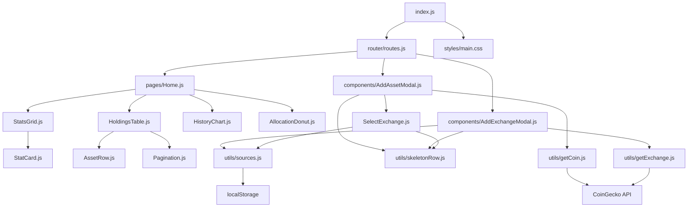

# CaletaJS — Índice de Arquitectura

> Documento generado automáticamente · Última actualización: 2026-04-14

## Visión General

**CaletaJS** es una SPA de seguimiento simulado de inversiones en criptomonedas construida sin frameworks UI, usando **Vanilla JavaScript ES6+**, **Webpack 5** y **Tailwind CSS v4**.

### Principios Rectores

| Principio | Aplicación |
|---|---|
| Zero-JS por defecto | HTML semántico + CSS utilities, JS solo para interactividad |
| Sin frameworks | Componentes = funciones puras que retornan `string` (template literals) |
| Datos dinámicos | API CoinGecko + `localStorage` como persistencia |
| Accesibilidad (WCAG 2.1 AA) | `aria-label`, foco por teclado, HTML5 semántico |
| Performance | Lazy loading, skeleton loading, debounce en búsquedas |

---

## Stack Tecnológico

| Capa | Tecnología | Propósito |
|---|---|---|
| Lenguaje | JavaScript ES6+ | Lógica de app |
| Bundler | Webpack 5 + Babel | Build, HMR, procesamiento de assets |
| Estilos | Tailwind CSS v4 + PostCSS | Sistema de diseño utility-first |
| Routing | Hash Router custom | Navegación SPA (`#/path`) |
| Componentes | Template Literals | Funciones puras → HTML strings |
| Datos | CoinGecko API + localStorage | Precios, monedas, exchanges |
| Iconos | SVG Sprite (`sprite.svg`) | Sistema de íconos centralizado |
| Package Mgr | **pnpm** (v10.x) | Gestión de dependencias |

---

## Estructura de Directorios

```text
caleta/
├── public/
│   └── index.html                  # Shell HTML (meta, #header, #app, modals)
├── src/
│   ├── assets/
│   │   └── sprite.svg              # SVG sprite con todos los íconos
│   ├── components/
│   │   ├── AddAssetModal.js        # Modal para agregar activos (multi-vista)
│   │   ├── AddExchangeModal.js     # Modal para agregar caletas/exchanges
│   │   ├── AllocationDonut.js      # Gráfico donut de distribución
│   │   ├── AssetRow.js             # Fila de activo en tabla de holdings
│   │   ├── Header.js               # Navegación principal
│   │   ├── HistoryChart.js         # Gráfico de historial de valor
│   │   ├── HoldingsTable.js        # Tabla paginada de activos
│   │   ├── Pagination.js           # Componente de paginación
│   │   ├── SelectExchange.js       # Selector de exchanges (desde localStorage)
│   │   ├── StatCard.js             # Tarjeta de estadística
│   │   └── StatsGrid.js            # Grid de estadísticas
│   ├── pages/
│   │   └── Home.js                 # Vista principal (dashboard)
│   ├── router/
│   │   └── routes.js               # Mapa de rutas + init post-render
│   ├── styles/
│   │   └── main.css                # CSS global + @theme tokens de Tailwind
│   ├── utils/
│   │   ├── formatters.js           # formatUsd, now, formatBalance
│   │   ├── getCoin.js              # API helper: buscar monedas (CoinGecko)
│   │   ├── getExchange.js          # API helper: buscar exchanges (CoinGecko)
│   │   ├── getHash.js              # Extraer segmento del hash
│   │   ├── holdingsData.js         # Datos mock estáticos para Holdings
│   │   ├── resolveRoutes.js        # Resolver hash → clave de ruta
│   │   ├── skeletonRow.js          # Skeleton loading row reutilizable
│   │   └── sources.js              # localStorage helper (getSource/addSource)
│   └── index.js                    # Entry point (importa CSS + router)
├── package.json
├── webpack.config.js
├── tailwind.config.js
├── postcss.config.js
└── babel.config.json
```

---

## Diagrama de Dependencias



---

## Documentación Detallada

| Documento | Descripción |
|---|---|
| [patrones.md](patrones.md) | Patrones de diseño: componentes, event wiring, event delegation, skeleton loading |
| [flujo-de-datos.md](flujo-de-datos.md) | Flujo de datos: API → localStorage → render |
| [sistema-de-diseno.md](sistema-de-diseno.md) | Design tokens, paleta de colores, tipografía |
| [accesibilidad.md](accesibilidad.md) | Cumplimiento WCAG 2.1 AA |
| [seo.md](seo.md) | Estrategia SEO para SPA |
| [testing.md](testing.md) | Estrategia de testing |

## Decisiones de Arquitectura (ADR)

| ADR | Título |
|---|---|
| [001](../decisions/001-webpack-bundler.md) | Webpack como bundler |
| [002](../decisions/002-arquitectura-sin-framework.md) | Arquitectura sin framework |
| [003](../decisions/003-hash-router.md) | Hash router |
| [004](../decisions/004-tailwind-css.md) | Tailwind CSS v4 |
| [005](../decisions/005-datos-estaticos.md) | Datos estáticos provisionales |
| [006](../decisions/006-migracion-api-coingecko.md) | Migración a API CoinGecko + localStorage |

## Runbooks

| Runbook | Descripción |
|---|---|
| [desarrollo-local.md](../runbooks/desarrollo-local.md) | Setup del entorno local |
| [agregar-ruta.md](../runbooks/agregar-ruta.md) | Agregar una nueva ruta/vista |
| [troubleshooting.md](../runbooks/troubleshooting.md) | Problemas comunes y soluciones |
| [deploy.md](../runbooks/deploy.md) | Proceso de despliegue |
