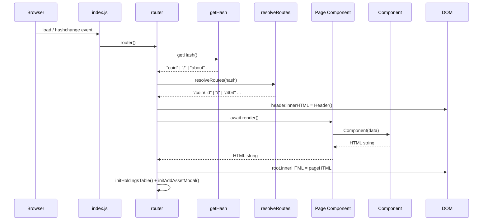
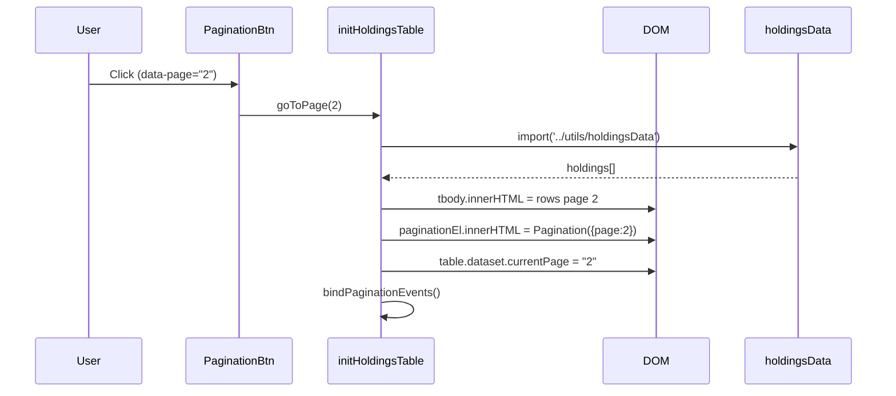

# Flujo de Datos

---

## Flujo principal: Navegación y Renderizado



---

## Flujo de paginación (HoldingsTable)



---

## Flujo del Modal AddAsset

```mermaid
sequenceDiagram
    participant User
    participant ActionToolbar
    participant initAddAssetModal
    participant AddAssetModal
    participant renderInner
    participant DOM

    User->>ActionToolbar: Click "Add Funds" (#add-funds)
    ActionToolbar->>initAddAssetModal: openModal()
    initAddAssetModal->>renderInner: currentView = "form"
    renderInner->>DOM: modal-inner.innerHTML = FormView()
    renderInner->>renderInner: wireFormView()

    User->>DOM: Click "Coin Selector"
    wireFormView->>renderInner: currentView = "coin"
    renderInner->>DOM: modal-inner.innerHTML = CoinPickerView()
    renderInner->>renderInner: wireCoinView()

    User->>DOM: Select a coin
    wireCoinView->>renderInner: selectedCoin = found; currentView = "form"
    renderInner->>DOM: Vuelve a FormView() con nuevo coin
```

---

## Estado de la aplicación

La aplicación no tiene un store centralizado. El estado se distribuye así:

| Variable / Fuente          | Tipo                         | Dónde vive                        | Propósito                                 |
|----------------------------|------------------------------|-----------------------------------|-------------------------------------------|
| `activeTab`                | `'buy'\|'sell'\|'transfer'`  | Módulo `AddAssetModal.js` (let)   | Pestaña activa del formulario             |
| `selectedCoin`             | `Coin`                       | Módulo `AddAssetModal.js` (let)   | Moneda seleccionada en el modal           |
| `selectedExchange`         | `Exchange`                   | Módulo `AddAssetModal.js` (let)   | Exchange seleccionado en el modal         |
| `currentView`              | `'form'\|'exchange'\|'coin'` | Módulo `AddAssetModal.js` (let)   | Vista activa dentro del modal             |
| `data-current-page`        | `number` (string en DOM)     | `<table#holdings-table>` dataset  | Página actual de holdings                 |
| `data-total-pages`         | `number` (string en DOM)     | `<table#holdings-table>` dataset  | Total de páginas de holdings              |
| `holdings`                 | `Asset[]`                    | `utils/holdingsData.js` (const)   | Dataset completo de activos del usuario   |
| `coins`                    | `Coin[]`                     | `utils/coinsData.js` (const)      | Catálogo de criptomonedas disponibles     |
| `exchanges`                | `Exchange[]`                 | `utils/exchangesData.js` (const)  | Catálogo de exchanges disponibles         |

> **Nota:** Todo el estado de datos es actualmente estático (sin API). Los datasets son arrays exportados desde los archivos `utils/*Data.js`.

---

## Fuentes de datos

Actualmente la app utiliza **datos simulados estáticos**. No realiza llamadas reales a APIs externas.

| Módulo                  | Contenido                                        |
|-------------------------|--------------------------------------------------|
| `utils/holdingsData.js` | Array de activos en cartera del usuario          |
| `utils/coinsData.js`    | Catálogo de criptomonedas (nombre, símbolo, logo)|
| `utils/exchangesData.js`| Catálogo de exchanges (nombre, logo, label)      |
| `utils/sources.js`      | Fuentes o exchanges por defecto                  |
| `utils/getCoin.js`      | Helper para buscar una coin por ID               |
| `utils/getExchange.js`  | Helper para buscar un exchange por ID            |

---

*Última actualización: 2026-03-15*
