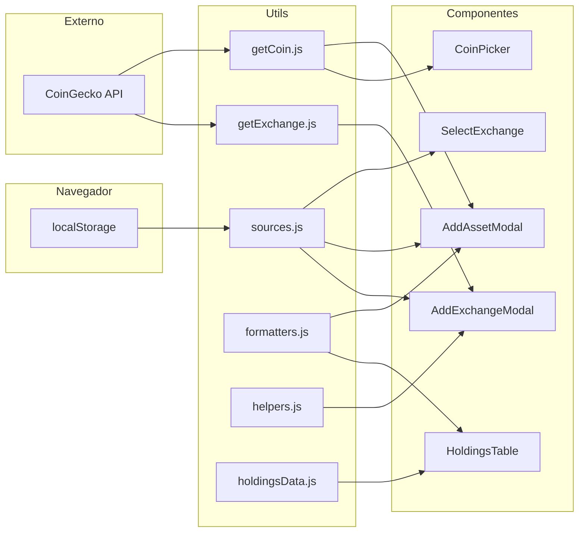
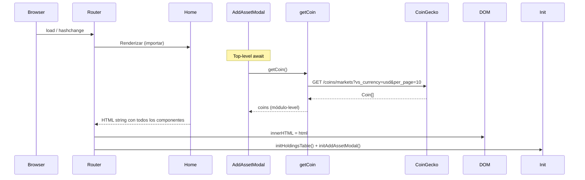
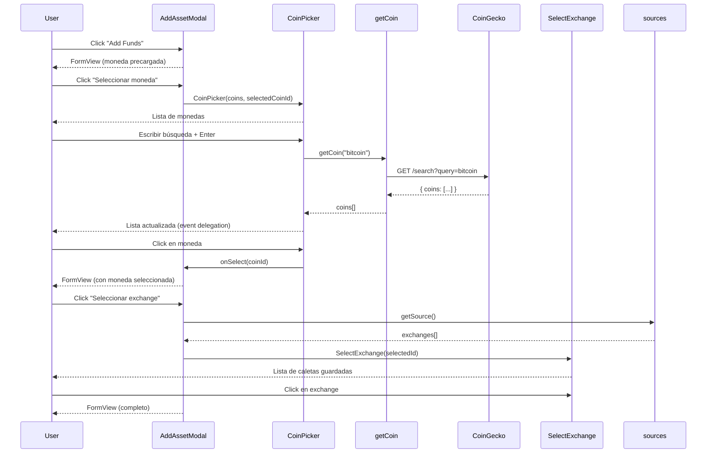
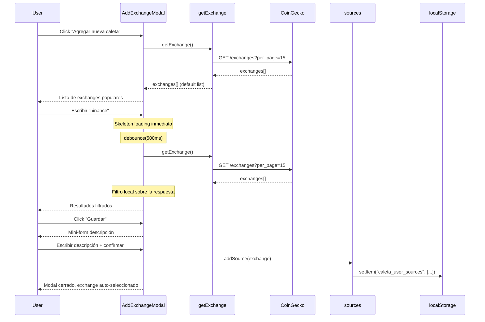

# Flujo de Datos

> Última actualización: 2026-04-15

## Fuentes de Datos

| Fuente | Tipo | Uso |
|---|---|---|
| CoinGecko API | Externa (REST) | Buscar monedas (`/search`), listar top monedas (`/coins/markets`), buscar exchanges (`/exchanges`) |
| `localStorage` | Local (navegador) | Persistir caletas/exchanges del usuario (`caleta_user_sources`) |
| `holdingsData.js` | Estático (mock) | Datos provisionales para la tabla de holdings |
| `.env` | Compilación | Claves API y URL base inyectadas vía `dotenv-webpack` |

---

## Diagrama General



---

## Flujos Principales

### 1. Carga Inicial (Home)



> **Nota:** `AddAssetModal` usa top-level `await` para precargar monedas al importar el módulo. La tabla `HoldingsTable` aún usa datos mock de `holdingsData.js`.

### 2. Agregar Activo (AddAssetModal)



### 3. Agregar Exchange (AddExchangeModal)



---

## Estado de la Aplicación

| Dato | Ubicación | Persistencia |
|---|---|---|
| Exchanges del usuario (caletas) | `localStorage.caleta_user_sources` | ✅ Persistente |
| Monedas iniciales (top 10) | Variable módulo en `AddAssetModal.js` | ❌ En memoria (precargadas) |
| Moneda seleccionada (en modal) | Variable local del modal (`selectedCoin`) | ❌ En memoria |
| Exchange seleccionado (en modal) | Variable local del modal (`selectedExchange`) | ❌ En memoria |
| Holdings/portafolio | `holdingsData.js` (mock) | ❌ Estático |
| Resultados búsqueda exchanges | Variable local de `AddExchangeModal` | ❌ En memoria |
| Página actual de tabla | `data-current-page` en DOM + variable local | ❌ En memoria |
| Estado de formulario (qty, price, date, fees, notes) | Variables locales en `AddAssetModal` | ❌ En memoria |
| Tab activo (buy/sell/transfer) | Variable local en `AddAssetModal` (`activeTab`) | ❌ En memoria |

---

## API CoinGecko — Endpoints Usados

| Endpoint | Helper | Propósito |
|---|---|---|
| `GET /coins/markets?vs_currency=usd&per_page=10` | `getCoin.js` (sin args) | Top 10 monedas por market cap |
| `GET /search?query={q}` | `getCoin.js` (con args) | Buscar monedas por nombre/símbolo |
| `GET /exchanges?per_page=15` | `getExchange.js` (sin args) | Listar exchanges populares |
| `GET /exchanges/{id}` | `getExchange.js` (con args) | Detalle de un exchange |

### Autenticación

```javascript
headers: {
  'x-cg-demo-api-key': process.env.API_KEY,
  'Content-Type': 'application/json'
}
```

### Rate Limiting

La API pública de CoinGecko tiene un límite de **10-30 req/min**. Se aplica:

- **Debounce** en búsquedas de exchanges (500ms) con skeleton loading inmediato
- **Búsqueda de monedas por Enter** — no se dispara con cada keystroke
- **Carga única** de exchanges por defecto (al abrir el AddExchangeModal)
- **Sin polling** — datos se refrescan solo por acción del usuario
