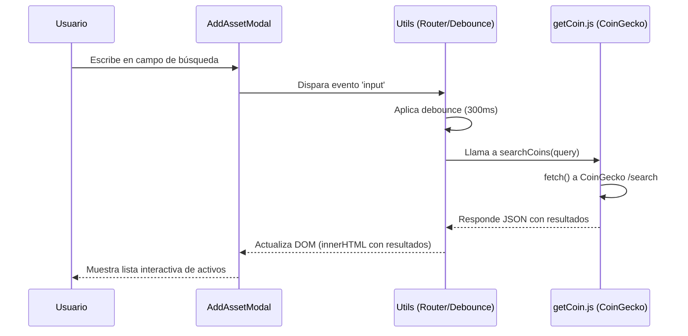
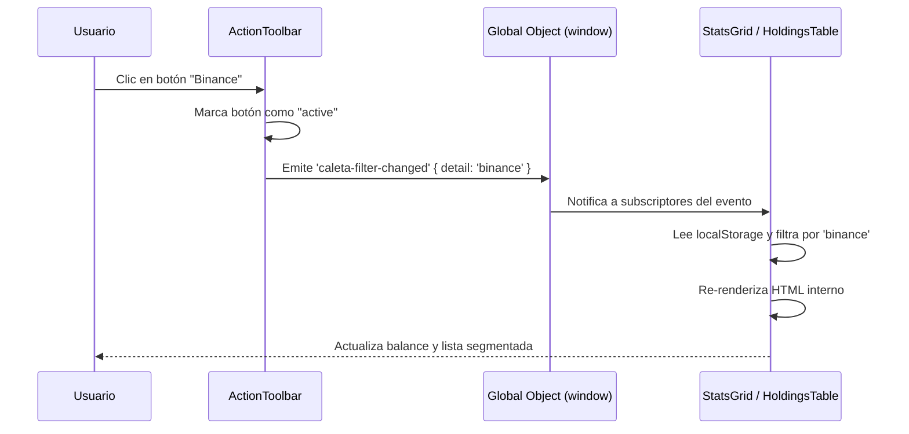
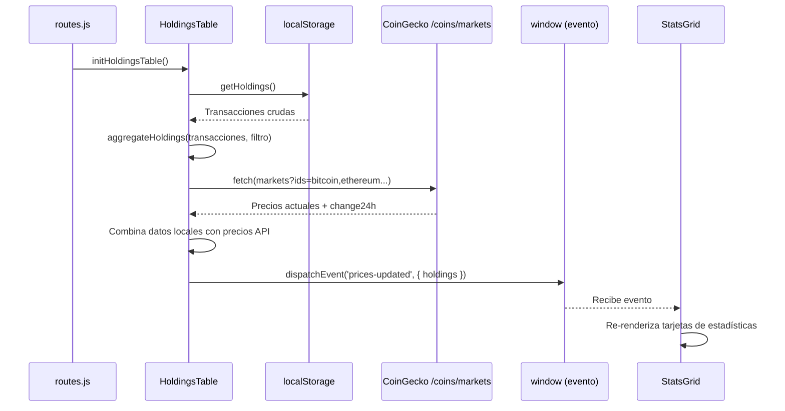
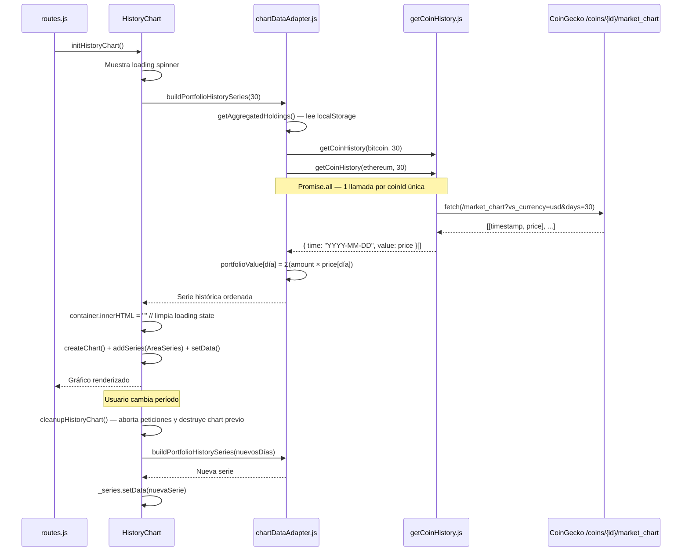
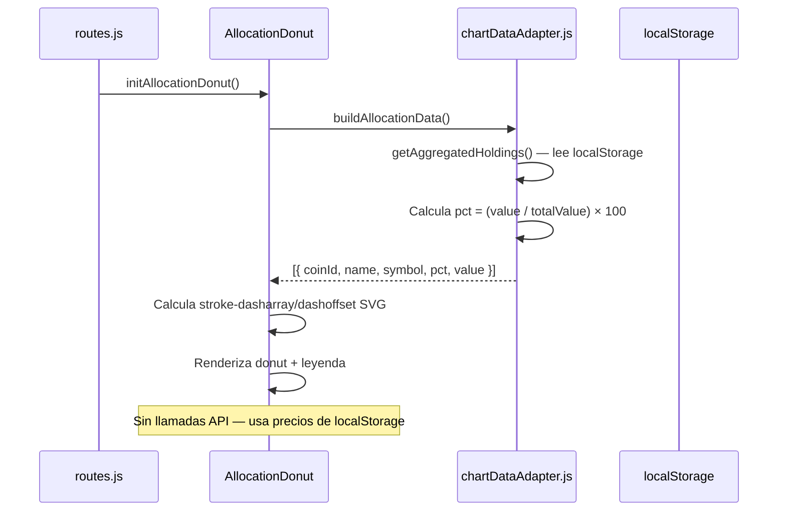
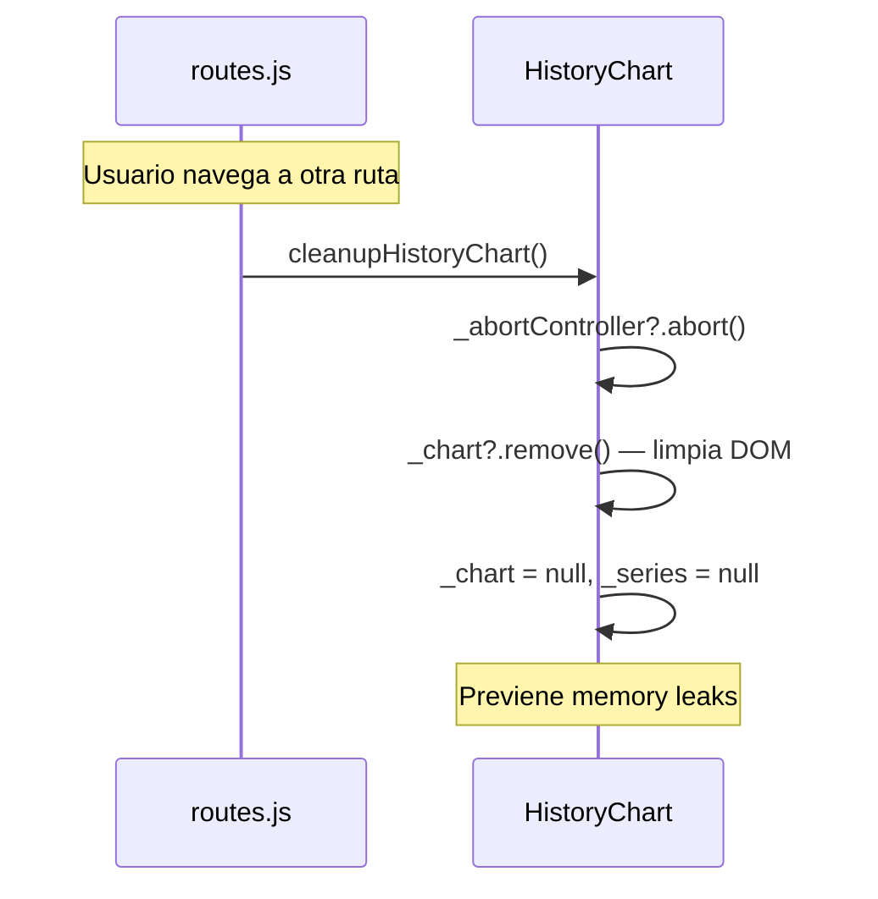
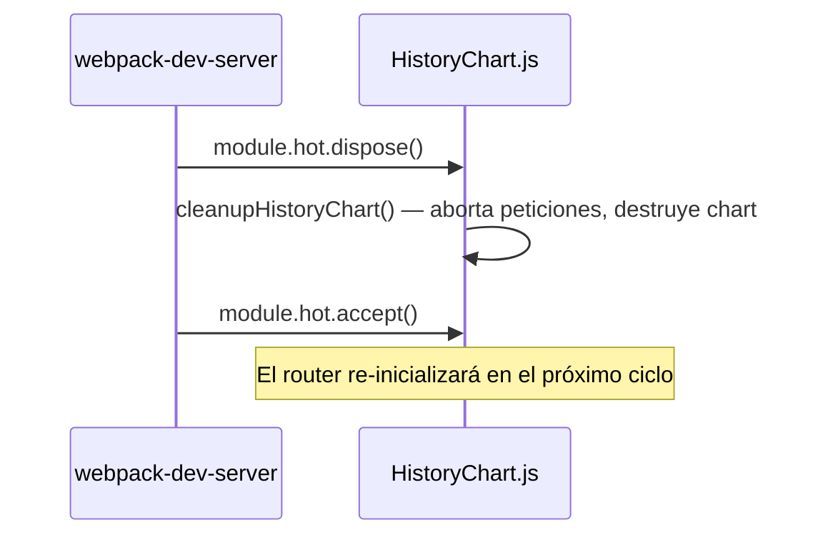

# Flujo de Datos y Estado

CaletaJS mantiene un flujo de datos en su mayoría unidireccional y sin gestión global del estado, apoyándose en la re-evaluación del HTML y APIs del navegador como LocalStorage para el estado persistente.

## Diagramas de Flujo

### 1. Búsqueda de Criptomonedas


### 2. Filtrado por Caleta (Inter-componente)


### 3. Carga de Datos del Portafolio (HoldingsTable → StatsGrid)


### 4. HistoryChart (Async — CoinGecko /market_chart)


### 5. AllocationDonut (Síncrono — localStorage)


### 6. Navegación SPA — Cleanup


## Gestión del Estado

No existe un "Store" global (como Redux o Zustand). El estado se divide en dos categorías:

### 1. Estado de UI (Efímero)
Se gestiona localmente dentro de las funciones inicializadoras (`init*`) a través de variables en los cierres (closures) de las funciones.
- **Ejemplo:** Paginación en `HoldingsTable.js`. El componente usa `data-attributes` en el DOM (`data-current-page`) para almacenar el estado y regenerar únicamente el cuerpo de la tabla (`tbody.innerHTML`) tras hacer clic en un control.

### 2. Estado Persistente
Se guarda utilizando el wrapper `storage.js` sobre `localStorage` nativo.

| Variable | Tipo | Propósito | Localización |
|---|---|---|---|
| `caleta_user_sources` | Array de Objetos | Mantiene la lista de "sources" de activos configurados por el usuario. | `src/utils/sources.js` |
| `caleta_holdings` | Array de Objetos | Almacena el historial de transacciones (compras/ventas/fuentes). | `src/utils/holdingsStorage.js` |

## Lógica de Consumo de APIs

Los datos remotos (CoinGecko) se solicitan a través de los helpers en `src/utils/` (`getCoin.js`, `getExchange.js`, `getCoinHistory.js`).

Las funciones están estructuradas para atrapar errores y retornar estados consistentes o *defaults* vacíos si el fetch falla, garantizando que los inicializadores puedan continuar y renderizar esqueletos o mensajes de error sin romper la aplicación.

### Endpoints de CoinGecko Utilizados

| Endpoint | Utilidad | Propósito | Frecuencia |
|---|---|---|---|
| `/search?query=` | `getCoin.js` | Búsqueda de monedas en AddAssetModal | On-demand (debounced 300ms) |
| `/exchanges` | `getExchange.js` | Lista de exchanges disponibles | On-demand (al abrir modal) |
| `/coins/markets?ids=` | `HoldingsTable.js` | Precios actuales + change24h + sparkline | Al cargar `/` y al refresh manual |
| `/coins/{id}/market_chart` | `getCoinHistory.js` | Historial de precios para HistoryChart | Al cargar `/` y al cambiar período |

### Patrón de Comunicación entre Componentes

```
HoldingsTable (productor)
    │
    ├── CustomEvent: 'prices-updated' → { detail: { holdings } }
    │       └── StatsGrid (consumidor) — re-renderiza tarjetas
    │
    └── CustomEvent: 'caleta-filter-changed' → { detail: { source } }
            └── HoldingsTable (auto-consumidor) — re-filtra datos

HistoryChart (productor y consumidor propio)
    ├── Lee localStorage vía chartDataAdapter.getAggregatedHoldings()
    ├── Llama /market_chart por cada coinId
    └── AbortController cancela peticiones anteriores al cambiar período

AllocationDonut (consumidor pasivo)
    ├── Lee localStorage vía chartDataAdapter.buildAllocationData()
    └── Sin llamadas API — usa precios almacenados en holdings
```

---
*Última actualización: 2026-05-23*

### 7. HMR — Hot Module Replacement (Vanilla JS)


> **Nota:** En vanilla JS (sin React Refresh), cada módulo debe aceptar explícitamente sus propias actualizaciones. `HistoryChart.js` mantiene referencias al DOM y estado interno de Lightweight Charts, por lo que requiere cleanup explícito antes de la recarga en caliente.

