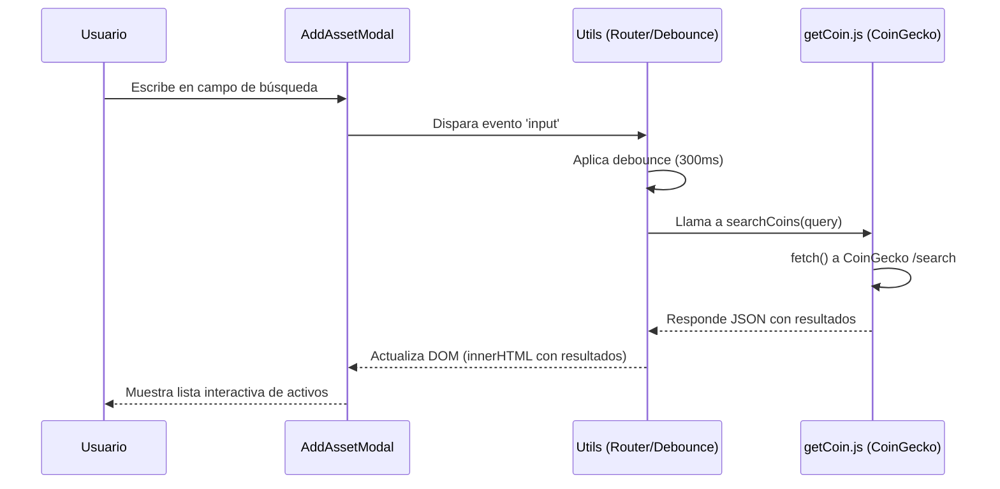
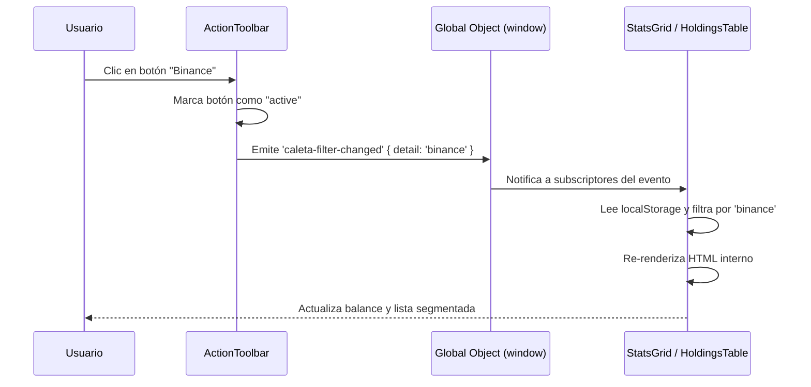
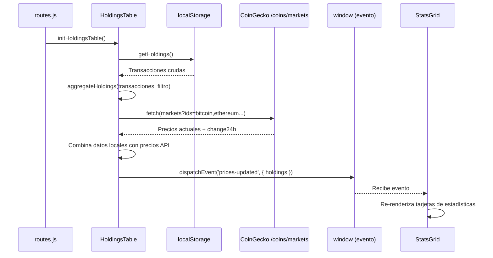
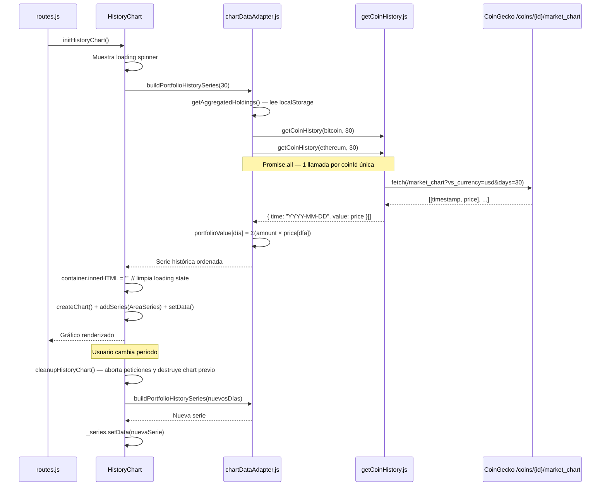
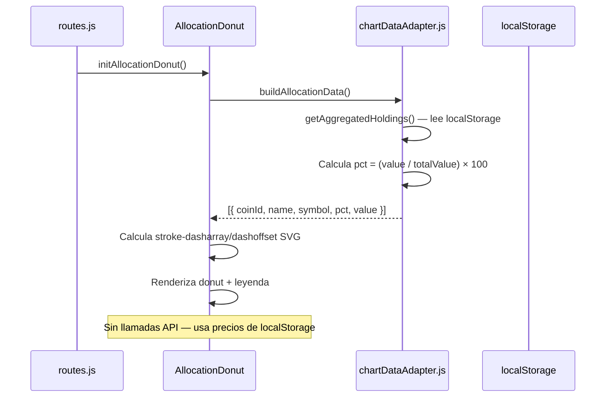
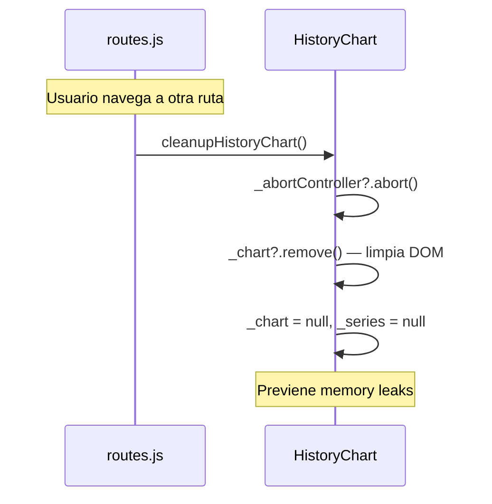
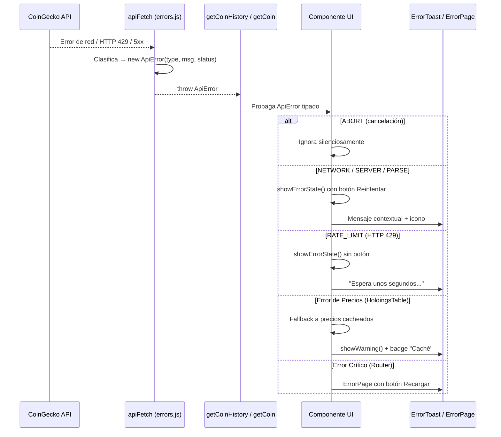
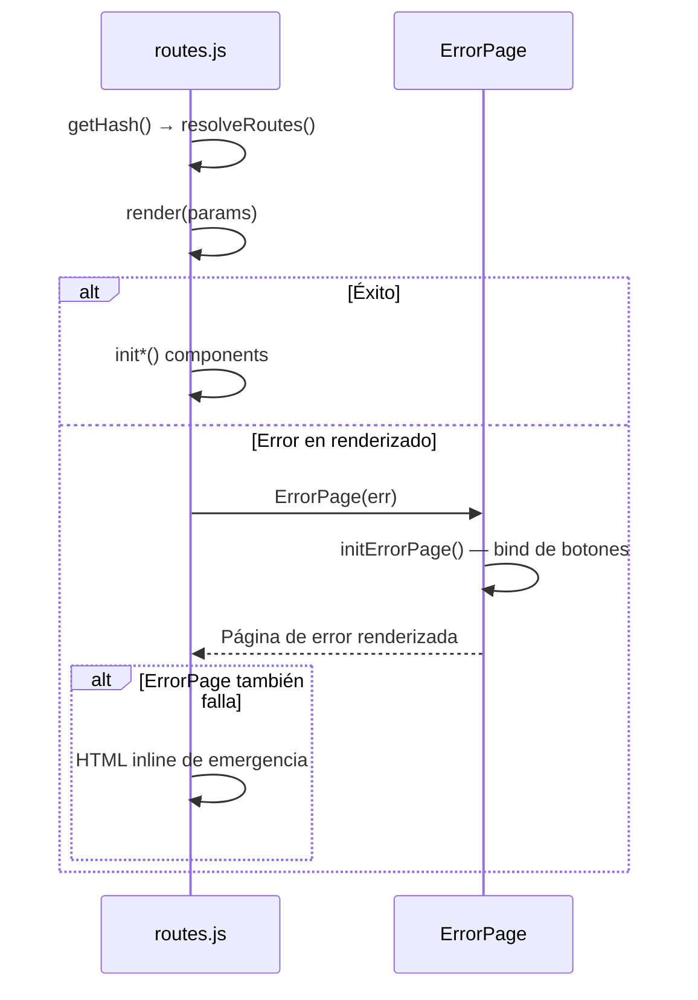
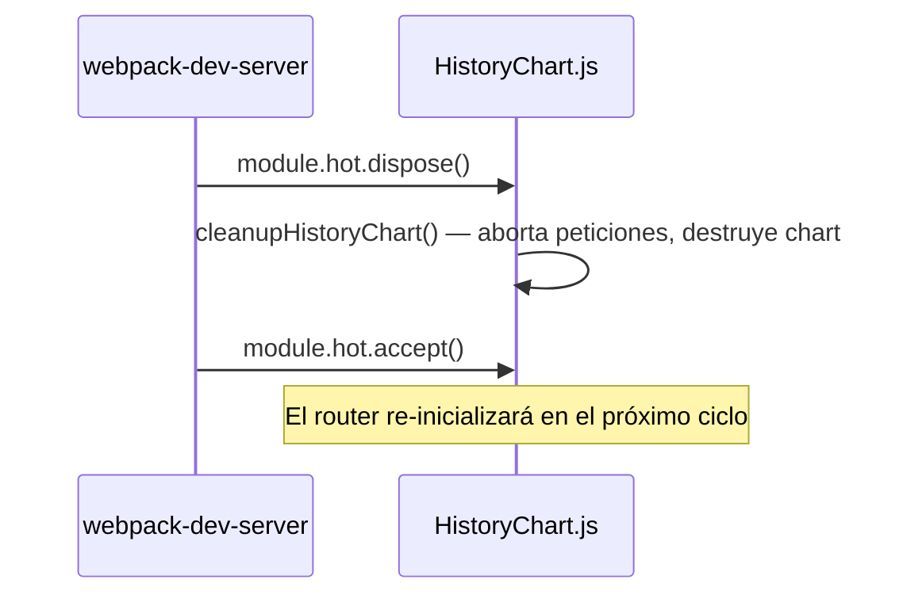

# Flujo de Datos y Estado

CaletaJS mantiene un flujo de datos en su mayoría unidireccional y sin gestión global del estado, apoyándose en la re-evaluación del HTML y APIs del navegador como LocalStorage para el estado persistente.

## Diagramas de Flujo

### 1. Búsqueda de Criptomonedas


### 2. Filtrado por Caleta (Inter-componente)


### 3. Carga de Datos del Portafolio (HoldingsTable → StatsGrid)


### 4. HistoryChart (Async — CoinGecko /market_chart)


### 5. AllocationDonut (Síncrono — localStorage)


### 6. Navegación SPA — Cleanup


### 7. Manejo de Errores — Flujo Tipado con ApiError



### 8. Boundary Global del Router (Try-Catch)



## Gestión del Estado

No existe un "Store" global (como Redux o Zustand). El estado se divide en dos categorías:

### 1. Estado de UI (Efímero)
Se gestiona localmente dentro de las funciones inicializadoras (`init*`) a través de variables en los cierres (closures) de las funciones.
- **Ejemplo:** Paginación en `HoldingsTable.js`. El componente usa `data-attributes` en el DOM (`data-current-page`) para almacenar el estado y regenerar únicamente el cuerpo de la tabla (`tbody.innerHTML`) tras hacer clic en un control.

### 2. Estado Persistente
Se guarda utilizando el wrapper `storage.js` sobre `localStorage` nativo.

| Variable | Tipo | Propósito | Localización |
|---|---|---|---|
| `caleta_user_sources` | Array de Objetos | Mantiene la lista de "sources" de activos configurados por el usuario. | `src/utils/sources.js` |
| `caleta_holdings` | Array de Objetos | Almacena el historial de transacciones (compras/ventas/fuentes). | `src/utils/holdingsStorage.js` |

## Lógica de Consumo de APIs

Los datos remotos (CoinGecko) se solicitan a través de los helpers en `src/utils/` (`getCoin.js`, `getExchange.js`, `getCoinHistory.js`).

### Capa de Errores Centralizada

Todas las llamadas a la API pasan por `apiFetch()` (`src/utils/errors.js`), que actúa como wrapper sobre `fetch()` y **siempre lanza `ApiError` tipado** en caso de fallo. Esto reemplaza el patrón anterior de `try/catch` con `console.error` + retorno de defaults vacíos.

El `ApiError` clasifica cada fallo en uno de 6 tipos (`NETWORK`, `RATE_LIMIT`, `NOT_FOUND`, `SERVER`, `PARSE`, `ABORT`), permitiendo que cada componente decida cómo responder:

- **`ABORT`:** Ignorado silenciosamente (cancelación intencional vía `AbortController`)
- **`RATE_LIMIT`:** Mensaje de espera sin botón de reintento
- **`NETWORK` / `SERVER` / `PARSE`:** Estado de error con botón "Reintentar"
- **`NOT_FOUND`:** Mensaje descriptivo sin acción de recuperación

Los helpers de dominio (`getCoin`, `getCoinHistory`, `getExchange`) propagan el `ApiError` hacia los componentes, que son responsables de la presentación del error al usuario mediante `ErrorToast`, estados de error inline, o `ErrorPage` (para fallos críticos del router).

### Endpoints de CoinGecko Utilizados

| Endpoint | Utilidad | Propósito | Frecuencia | Error Handling |
|---|---|---|---|---|
| `/search?query=` | `getCoin.js` | Búsqueda de monedas en AddAssetModal | On-demand (debounced 300ms) | `CoinPicker`: mensaje contextual + botón Reintentar |
| `/exchanges` | `getExchange.js` | Lista de exchanges disponibles | On-demand (al abrir modal) | `ApiError` propagado al caller |
| `/coins/markets?ids=` | `HoldingsTable.js` | Precios actuales + change24h + sparkline | Al cargar `/` y al refresh manual | Fallback a precios cacheados + toast warning + badge "Caché" |
| `/coins/{id}/market_chart` | `getCoinHistory.js` | Historial de precios para HistoryChart | Al cargar `/` y al cambiar período | `HistoryChart`: estado de error tipado + botón Reintentar |

### Patrón de Comunicación entre Componentes

```
HoldingsTable (productor)
    │
    ├── CustomEvent: 'prices-updated' → { detail: { holdings, usingCachedPrices } }
    │       └── StatsGrid (consumidor) — re-renderiza tarjetas (con badge "Caché" si aplica)
    │
    └── CustomEvent: 'caleta-filter-changed' → { detail: { source } }
            └── HoldingsTable (auto-consumidor) — re-filtra datos

HistoryChart (productor y consumidor propio)
    ├── Lee localStorage vía chartDataAdapter.getAggregatedHoldings()
    ├── Llama /market_chart por cada coinId
    ├── AbortController cancela peticiones anteriores al cambiar período
    └── ApiError → showErrorState() con mensaje tipado + botón Reintentar

AllocationDonut (consumidor pasivo)
    ├── Lee localStorage vía chartDataAdapter.buildAllocationData()
    └── Sin llamadas API — usa precios almacenados en holdings

ErrorToast (consumidor global)
    ├── showError() / showWarning() / showSuccess() / showInfo()
    ├── Monta toasts en #app-error-toast (z-index: 9999)
    └── Auto-dismiss con animación + botón de cierre manual
```

---
*Última actualización: 2026-05-30*

### 7. HMR — Hot Module Replacement (Vanilla JS)


> **Nota:** En vanilla JS (sin React Refresh), cada módulo debe aceptar explícitamente sus propias actualizaciones. `HistoryChart.js` mantiene referencias al DOM y estado interno de Lightweight Charts, por lo que requiere cleanup explícito antes de la recarga en caliente.

