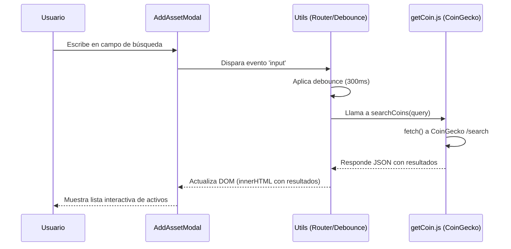
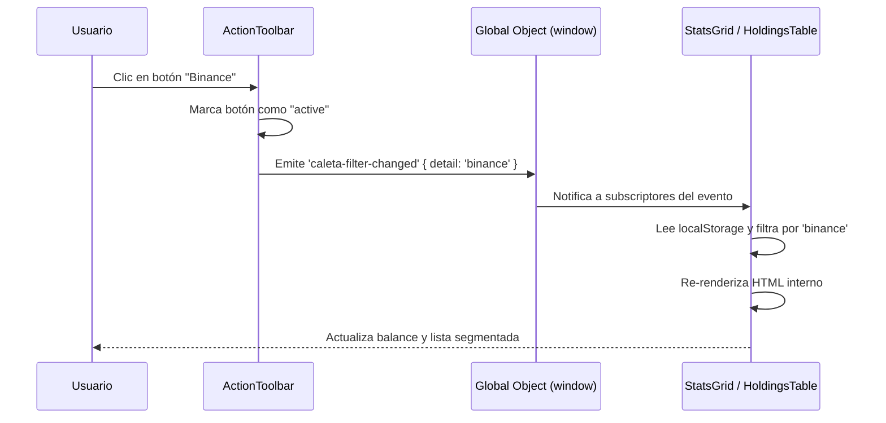

# Flujo de Datos y Estado

CaletaJS mantiene un flujo de datos en su mayoría unidireccional y sin gestión global del estado, apoyándose en la re-evaluación del HTML y APIs del navegador como LocalStorage para el estado persistente.

## Diagramas de Flujo

### 1. Búsqueda de Criptomonedas

### 2. Filtrado por Caleta (Inter-componente)

## Gestión del Estado

No existe un "Store" global (como Redux o Zustand). El estado se divide en dos categorías:

### 1. Estado de UI (Efímero)
Se gestiona localmente dentro de las funciones inicializadoras (`init*`) a través de variables en los cierres (closures) de las funciones.
- **Ejemplo:** Paginación en `HoldingsTable.js`. El componente usa `data-attributes` en el DOM (`data-current-page`) para almacenar el estado y regenerar únicamente el cuerpo de la tabla (`tbody.innerHTML`) tras hacer clic en un control.

### 2. Estado Persistente
Se guarda utilizando el wrapper `storage.js` sobre `localStorage` nativo.

| Variable | Tipo | Propósito | Localización |
|---|---|---|---|
| `caleta_user_sources` | Array de Objetos | Mantiene la lista de "sources" de activos configurados por el usuario. | `src/utils/sources.js` |
| `caleta_holdings` | Array de Objetos | Almacena el historial de transacciones (compras/ventas/fuentes). | `src/utils/holdingsStorage.js` |

## Lógica de Consumo de APIs

Los datos remotos (CoinGecko) se solicitan a través de los helpers en `src/utils/` (`getCoin.js`, `getExchange.js`). 

Las funciones están estructuradas para atrapar errores y retornar estados consistentes o *defaults* vacíos si el fetch falla, garantizando que los inicializadores puedan continuar y renderizar esqueletos o mensajes de error sin romper la aplicación.

---
*Última actualización: 2026-05-09*
