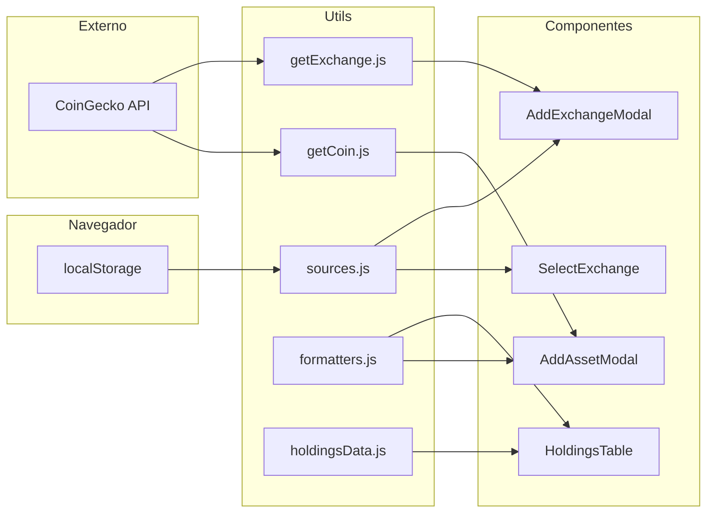
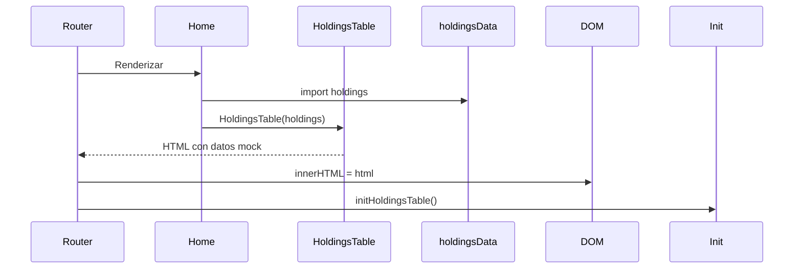
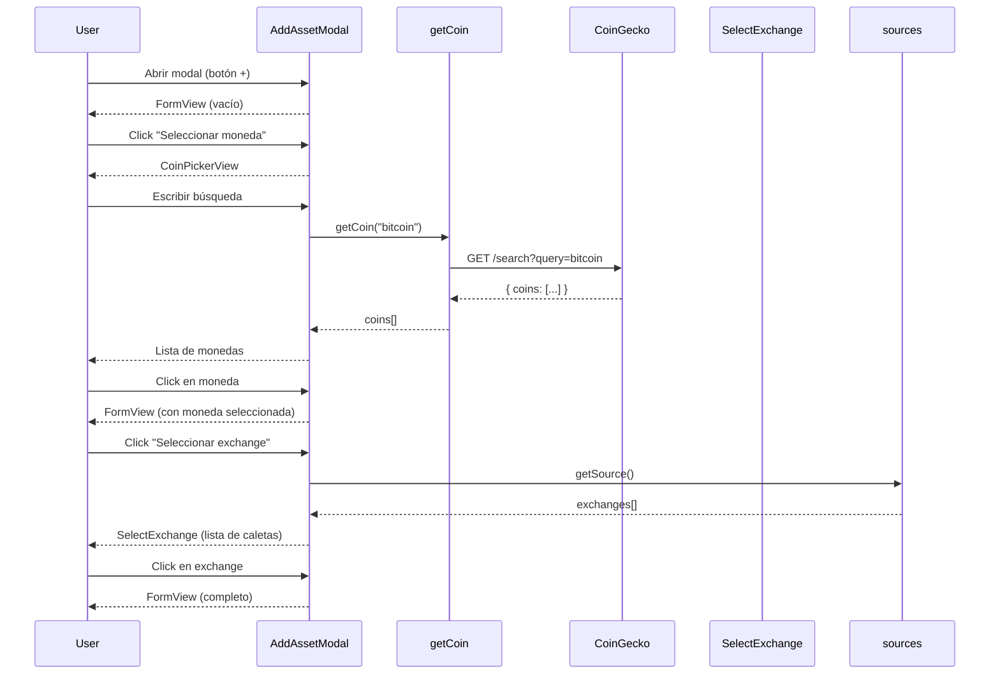
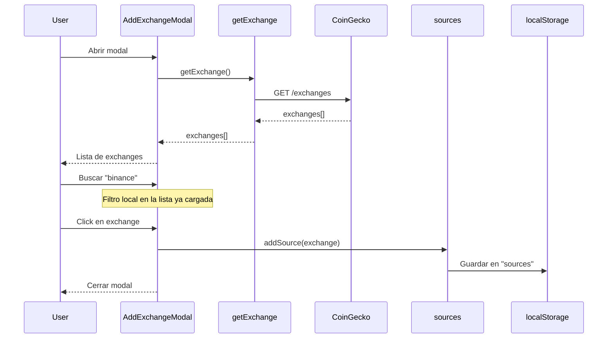

# Flujo de Datos

> Última actualización: 2026-04-14

## Fuentes de Datos

| Fuente | Tipo | Uso |
|---|---|---|
| CoinGecko API | Externa (REST) | Buscar monedas (`/search`), buscar exchanges (`/exchanges`) |
| `localStorage` | Local (navegador) | Persistir caletas/exchanges del usuario (`sources`) |
| `holdingsData.js` | Estático (mock) | Datos provisionales para la tabla de holdings |

---

## Diagrama General

---

## Flujos Principales

### 1. Carga Inicial (Home)

> **Nota:** Actualmente usa datos estáticos (`holdingsData.js`). Se migrará a datos reales de `localStorage` + API.

### 2. Agregar Activo (AddAssetModal)

### 3. Agregar Exchange (AddExchangeModal)

---

## Estado de la Aplicación

| Dato | Ubicación | Persistencia |
|---|---|---|
| Exchanges del usuario (caletas) | `localStorage.sources` | ✅ Persistente |
| Moneda seleccionada (en modal) | Variable local del modal | ❌ En memoria |
| Exchange seleccionado (en modal) | Variable local del modal | ❌ En memoria |
| Holdings/portafolio | `holdingsData.js` (mock) | ❌ Estático |
| Resultados de búsqueda (coins) | Variable local del modal | ❌ En memoria |
| Página actual de tabla | Variable local de `initHoldingsTable` | ❌ En memoria |

---

## API CoinGecko — Endpoints Usados

| Endpoint | Helper | Propósito |
|---|---|---|
| `GET /search?query={q}` | `getCoin.js` | Buscar monedas por nombre/símbolo |
| `GET /exchanges` | `getExchange.js` | Listar exchanges disponibles |

### Rate Limiting

La API pública de CoinGecko tiene un límite de **10-30 req/min**. Se aplica:

- **Debounce** en búsquedas de monedas (300ms)
- **Carga única** de exchanges (al abrir el modal)
- **Sin polling** — datos se refrescan solo por acción del usuario
