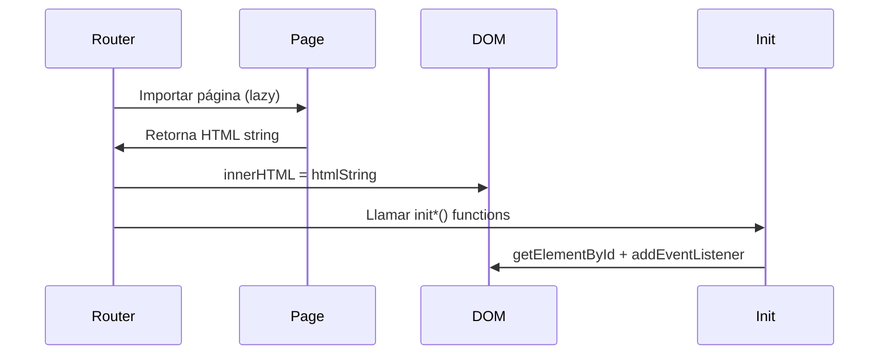
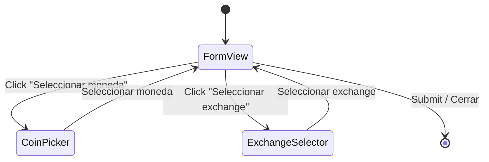

# Patrones de Diseño

> Última actualización: 2026-04-14

## 1. Componentes como Funciones Puras

Cada componente UI es una **función que retorna un `string` HTML** mediante template literals.

```javascript
// ✅ Correcto — función pura, sin side effects
const MyCard = (data) => `
  <article class="p-4 bg-slate-800 rounded-xl">
    <h3 class="font-bold text-white">${data.title}</h3>
    <p class="text-slate-400">${data.description ?? '—'}</p>
  </article>
`;
export default MyCard;
```

### Reglas

- **Sin `document.*`** dentro del componente — solo strings.
- **Props explícitos** — cada función recibe los datos que necesita.
- **Nullish coalescing** (`??`) para valores opcionales.
- **Optional chaining** (`?.`) para accesos profundos.

---

## 2. Event Wiring Post-Render

Los componentes retornan strings, así que **no se pueden adjuntar listeners inline**. Se usa el patrón `init*`:

```javascript
// En el componente
export const initMyComponent = () => {
  const btn = document.getElementById('my-btn');
  btn?.addEventListener('click', handleClick);
};

// En routes.js, DESPUÉS de inyectar el HTML
app.innerHTML = await Home();
initHoldingsTable();   // ← Aquí se conectan los eventos
```

### Ciclo de vida



---

## 3. Event Delegation

Para listas dinámicas cuyo contenido cambia (búsquedas, filtros), se usa **delegación de eventos** en el contenedor padre:

```javascript
// ✅ Correcto — un solo listener en el padre
container.addEventListener('click', (e) => {
  const row = e.target.closest('.coin-row');
  if (!row) return;
  
  const coinId = row.dataset.coinId;
  handleCoinSelect(coinId);
});
```

### Cuándo usar

| Escenario | Estrategia |
|---|---|
| Elementos estáticos (botones fijos) | `getElementById` + `addEventListener` directo |
| Listas dinámicas (resultados de búsqueda, rows) | **Event delegation** en contenedor padre |
| Elementos que se re-renderizan | **Event delegation** obligatorio |

---

## 4. Sistema de Modales Multi-Vista

Los modales complejos (`AddAssetModal`, `AddExchangeModal`) implementan un **patrón de sub-vistas** manejado por estado interno:

```javascript
let currentView = 'form';  // 'form' | 'coin' | 'exchange'
let state = { selectedCoin: null, selectedExchange: '' };

const render = () => {
  const views = {
    form:     () => FormView(state),
    coin:     () => CoinPickerView(state),
    exchange: () => SelectExchange(state.selectedExchange),
  };
  
  modalContent.innerHTML = views[currentView]();
  wireEvents();  // Re-conectar listeners
};
```

### Flujo



---

## 5. Skeleton Loading Compartido

Un único componente `SkeletonRow` en `utils/skeletonRow.js` genera placeholders animados reutilizables:

```javascript
import SkeletonRow from '../utils/skeletonRow';

// Mostrar N filas skeleton mientras carga
container.innerHTML = Array.from(
  { length: 5 },
  () => SkeletonRow()
).join('');
```

### Usado en

- `SelectExchange.js` — mientras carga la lista de caletas
- `AddExchangeModal.js` — mientras busca exchanges en la API
- `AddAssetModal.js` — mientras busca monedas en la API

---

## 6. API Helpers con Error Handling

Las llamadas a la API siguen un patrón consistente con manejo de errores graceful:

```javascript
const getCoin = async (query = '') => {
  try {
    const res = await fetch(`${BASE}/search?query=${query}`);
    if (!res.ok) return [];
    const data = await res.json();
    return data?.coins ?? [];
  } catch {
    return [];
  }
};
```

### Convenciones

- **Siempre retornar un valor por defecto** (`[]`, `null`) en caso de error.
- **Sin `throw`** — el consumidor no necesita `try/catch`.
- **`?.` y `??`** para protección contra respuestas inesperadas.

---

## 7. localStorage como "Base de Datos"

El módulo `sources.js` abstrae la interacción con `localStorage`:

```javascript
// Leer
const sources = getSource();         // → Exchange[] | ["Overview"]

// Escribir
addSource({ id, name, image, ... }); // Añade a la lista existente
```

### Estructura en localStorage

```json
{
  "sources": [
    {
      "id": "binance",
      "name": "Binance",
      "image": "https://...",
      "description": "Spot",
      "color": "#F0B90B"
    }
  ]
}
```
