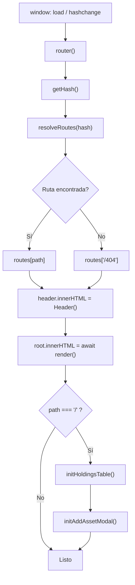
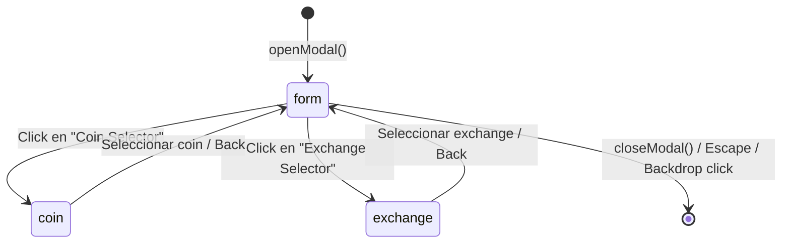

# Patrones de Diseño

Este documento describe los patrones arquitectónicos y de diseño empleados en CaletaJS.

---

## 1. Componentes como Funciones Puras (HTML Factory Pattern)

**Qué es:** Cada componente de UI es una función JavaScript que recibe datos y devuelve un string de HTML mediante template literals.

```javascript
// Ejemplo: StatCard.js
const StatCard = ({ title, value, badge = "" }) => `
  <article class="glass-panel rounded-xl p-5">
    <header>
      <h3 class="text-xs text-slate-400">${title}</h3>
    </header>
    <span class="text-2xl font-bold text-white">${value}</span>
    ${badge ? `<span class="text-xs">${badge}</span>` : ""}
  </article>
`;
```

**Por qué se eligió:**

| ✅ Pros | ⚠️ Contras |
|---------|-----------|
| Cero dependencias externas | No hay reactivity automática |
| Bundle mínimo (~50KB) | Re-renders manuales en actualizaciones |
| Curva de aprendizaje baja | Gestión de eventos imperativa post-mount |
| Máxima libertad de diseño | Sin Virtual DOM ni diffing |

> Cross-reference: [ADR-002 — Arquitectura sin frameworks](../decisions/002-arquitectura-sin-framework.md)

---

## 2. Hash-based Router

**Qué es:** El enrutador escucha eventos `hashchange` y `load` del navegador, extrae la ruta del hash de la URL y renderiza el componente correspondiente.

```
URL: http://localhost:8080/#/coin/bitcoin
                              ↑
                           hash = "coin/bitcoin"
                              ↓
                        getHash() → "coin"
                              ↓
                     resolveRoutes("coin") → "/coin/:id"
                              ↓
                     routes["/coin/:id"] = CoinDetails
```



| ✅ Pros | ⚠️ Contras |
|---------|-----------|
| Sin servidor especial (deploy a CDN simple) | URLs con `#` (no-SEO friendly para crawlers sin JS) |
| Compatible con todos los browsers | Limitado para apps con deep-linking complejo |
| Fácil de depurar (URL visible) | Cada navigate re-renderiza toda la página |

> Cross-reference: [ADR-003 — Hash Router](../decisions/003-hash-router.md)

---

## 3. Patrón Mount + Init (Hydration Manual)

**Qué es:** Dado que los componentes devuelven strings, los event listeners no pueden adjuntarse inline. El patrón separa el renderizado (componente HTML) de la interactividad (función `init`).

```javascript
// En routes.js — después de insertar HTML en el DOM:
root.innerHTML = await render();           // 1. Mount (string to DOM)
initHoldingsTable();                       // 2. Wire (attach events)
initAddAssetModal();                       // 3. Wire (attach events)
```

Cada componente interactivo exporta dos cosas:
1. **La función de render** (default export): devuelve `string`.
2. **La función `init`** (named export): busca elementos por ID y adjunta listeners.

```javascript
// HoldingsTable.js
export default HoldingsTable;        // render fn
export const initHoldingsTable = () => {
  const table = document.getElementById("holdings-table");
  // ... attach events
};
```

| ✅ Pros | ⚠️ Contras |
|---------|-----------|
| Patrón claro y predecible | Acoplamiento implícito entre routes.js e init fns |
| No requiere framework | Olvidar llamar `init` rompe la interactividad |
| Permite lazy-loading de módulos | No hay lifecycle hooks automáticos |

---

## 4. Patrón State-on-DOM (para Paginación)

**Qué es:** El estado de la paginación (página actual, total de páginas) se almacena en atributos `data-*` del elemento `<table>` en el DOM, evitando variables globales de módulo.

```html
<table
  id="holdings-table"
  data-current-page="1"
  data-total-pages="3"
  data-total-items="10"
  data-page-size="4"
>
```

```javascript
// initHoldingsTable lee el estado del DOM
const totalPages = Number(table.dataset.totalPages);
const currentPage = Number(table.dataset.currentPage);
```

| ✅ Pros | ⚠️ Contras |
|---------|-----------|
| No requiere store global | Solo viable para estado simple |
| Estado visible en DevTools | No escalable para estado complejo |
| Re-hidratación trivial | Acoplado a IDs de elementos DOM |

---

## 5. Patrón Sub-vistas en Modal (State Machine simplificada)

**Qué es:** El modal `AddAssetModal` gestiona múltiples vistas (formulario, selector de exchange, selector de coin) mediante una variable `currentView` que actúa como máquina de estados mínima.

```javascript
/** @type {'form'|'exchange'|'coin'} */
let currentView = "form";

const renderInner = () => {
  if (currentView === "exchange") { inner.innerHTML = SelectExchange(...); wireExchangeView(); }
  else if (currentView === "coin") { inner.innerHTML = CoinPickerView(); wireCoinView(); }
  else { inner.innerHTML = FormView(); wireFormView(); }
};
```

Transiciones de estado:



| ✅ Pros | ⚠️ Contras |
|---------|-----------|
| Navegación interna sin router | Estado de módulo (variable let) persiste entre aperturas |
| Re-render quirúrgico solo del modal | Difícil de escalar a más de 3-4 vistas |
| Transiciones CSS declarativas | Sin historial de navegación en el modal |

---

*Última actualización: 2026-03-15*
