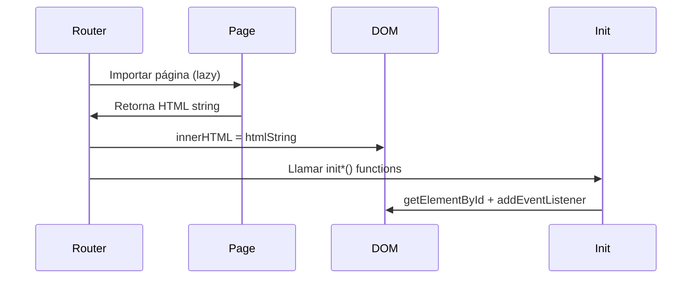
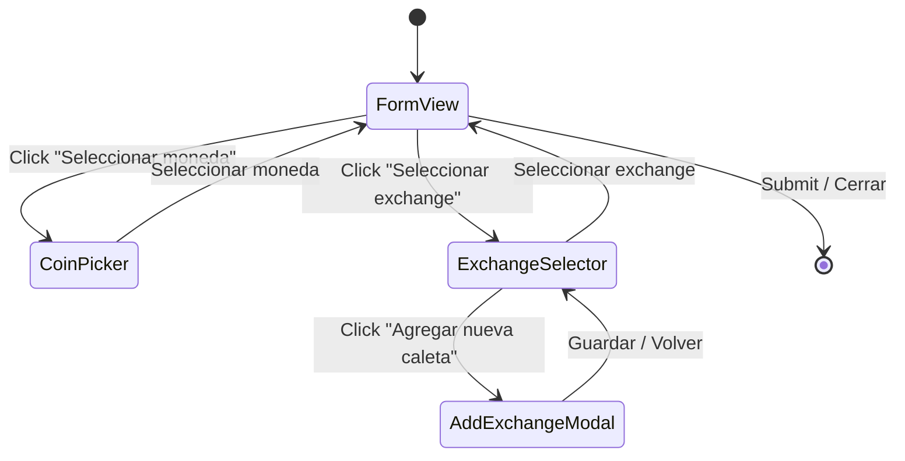

# Patrones de Diseño

> Última actualización: 2026-04-15

## 1. Componentes como Funciones Puras

Cada componente UI es una **función que retorna un `string` HTML** mediante template literals.

```javascript
// ✅ Correcto — función pura, sin side effects
const MyCard = (data) => `
  <article class="p-4 bg-slate-800 rounded-xl">
    <h3 class="font-bold text-white">${data.title}</h3>
    <p class="text-slate-400">${data.description ?? '—'}</p>
  </article>
`;
export default MyCard;
```

### Reglas

- **Sin `document.*`** dentro del componente — solo strings.
- **Props explícitos** — cada función recibe los datos que necesita.
- **Nullish coalescing** (`??`) para valores opcionales.
- **Optional chaining** (`?.`) para accesos profundos.

---

## 2. Event Wiring Post-Render

Los componentes retornan strings, así que **no se pueden adjuntar listeners inline**. Se usa el patrón `init*`:

```javascript
// En el componente
export const initMyComponent = () => {
  const btn = document.getElementById('my-btn');
  btn?.addEventListener('click', handleClick);
};

// En routes.js, DESPUÉS de inyectar el HTML
app.innerHTML = await Home();
initHoldingsTable();   // ← Aquí se conectan los eventos
initAddAssetModal();
```

### Ciclo de vida



---

## 3. Event Delegation

Para listas dinámicas cuyo contenido cambia (búsquedas, filtros), se usa **delegación de eventos** en el contenedor padre:

```javascript
// ✅ Correcto — un solo listener en el padre (CoinPicker.js)
coinList?.addEventListener('click', (e) => {
  const row = e.target.closest('.coin-row');
  if (!row) return;

  const coinId = row.dataset.coinId;
  onSelect(coinId);
});
```

### Cuándo usar

| Escenario | Estrategia |
|---|---|
| Elementos estáticos (botones fijos) | `getElementById` + `addEventListener` directo |
| Listas dinámicas (resultados de búsqueda, rows) | **Event delegation** en contenedor padre |
| Elementos que se re-renderizan | **Event delegation** obligatorio |

**Implementado en:** `CoinPicker.js` (coin list), `AddExchangeModal.js` (save buttons).

---

## 4. Sistema de Modales Multi-Vista

Los modales complejos (`AddAssetModal`, `AddExchangeModal`) implementan un **patrón de sub-vistas** manejado por estado interno:

```javascript
let currentView = 'form';  // 'form' | 'coin' | 'exchange'

const renderInner = () => {
  const inner = document.getElementById('modal-inner');
  if (!inner) return;

  if (currentView === 'exchange') {
    inner.innerHTML = SelectExchange(selectedExchange?.id);
    wireExchangeView();
  } else if (currentView === 'coin') {
    inner.innerHTML = CoinPicker(coins, selectedCoin.id);
    initCoinPicker({ onBack, onClose, onSelect, currentCoins, selectedCoinId });
  } else {
    inner.innerHTML = FormView();
    wireFormView();
  }
};
```

### Flujo



---

## 5. Componentes Init con Callbacks

Para sub-vistas renderizadas dentro de un modal, el patrón `init*` acepta **callbacks** que comunican acciones de vuelta al padre:

```javascript
// CoinPicker.js
const initCoinPicker = ({ onBack, onClose, onSelect, currentCoins, selectedCoinId }) => {
  document.getElementById('coin-back-btn')?.addEventListener('click', onBack);
  document.getElementById('coin-close-btn')?.addEventListener('click', onClose);

  // Event delegation para la lista de monedas
  coinList?.addEventListener('click', (e) => {
    const row = e.target.closest('.coin-row');
    if (!row) return;
    onSelect(row.dataset.coinId);
  });
};
```

> Cross-reference: [ADR-002 — Arquitectura sin framework](../decisions/002-arquitectura-sin-framework.md)

---

## 6. Skeleton Loading Compartido

Un único componente `SkeletonRow` en `utils/skeletonRow.js` genera placeholders animados reutilizables con parámetros configurables:

```javascript
import SkeletonRow from '../utils/skeletonRow';

// Mostrar N filas skeleton mientras carga
container.innerHTML = Array.from(
  { length: 5 },
  () => SkeletonRow({ avatarShape: 'rounded-xl', avatarSize: 'h-12 w-12' })
).join('');
```

### Parámetros configurables

| Parámetro | Default | Descripción |
|---|---|---|
| `avatarShape` | `'rounded-full'` | Forma del avatar placeholder |
| `avatarSize` | `'h-10 w-10'` | Tamaño del avatar |
| `titleWidth` | `'w-32'` | Ancho del bloque título |
| `subtitleWidth` | `'w-20'` | Ancho del bloque subtítulo |
| `actionSize` | `'h-8 w-20'` | Tamaño del bloque acción |
| `actionShape` | `'rounded-lg'` | Forma del bloque acción |
| `padding` | `'px-1 py-3'` | Padding del contenedor |

### Usado en

- `SelectExchange.js` — mientras carga la lista de caletas
- `AddExchangeModal.js` — mientras busca exchanges en la API
- `CoinPicker.js` — mientras busca monedas en la API

---

## 7. Debounce con Feedback Visual Inmediato

Las búsquedas en `AddExchangeModal` implementan **debounce** (500ms) con skeleton loading inmediato para dar feedback visual al usuario sin esperar el delay:

```javascript
import { debounce } from '../utils/helpers';

const optimizedSearch = debounce(searchExchanges, 500);

input.addEventListener('input', (e) => {
  const value = e.target.value.trim();

  // Feedback inmediato: mostrar skeleton
  if (searchState !== 'loading') {
    searchState = 'loading';
    renderResults(value);
  }

  // Búsqueda real diferida
  optimizedSearch(value);
});
```

> Cross-reference: [ADR-007 — Debounce en búsquedas](../decisions/007-debounce-busquedas.md)

---

## 8. API Helpers con Error Handling

Las llamadas a la API siguen un patrón consistente con manejo de errores graceful:

```javascript
const getCoin = async (id) => {
  const url = id
    ? `${API_URL}/search?query=${id}`
    : `${API_URL}/coins/markets?vs_currency=usd&order=market_cap_desc&per_page=10&page=1`;

  try {
    const response = await fetch(url, options);
    if (!response.ok) throw new Error(`API Error: ${response.status}`);
    return await response.json();
  } catch (error) {
    console.error('Error fetching data:', error);
    return null;
  }
};
```

### Convenciones

- **Siempre retornar un valor por defecto** (`[]`, `null`) en caso de error.
- **Sin `throw`** hacia el consumidor — el error se maneja internamente.
- **`?.` y `??`** para protección contra respuestas inesperadas.

---

## 9. localStorage como "Base de Datos"

El módulo `sources.js` abstrae la interacción con `localStorage`:

```javascript
// Leer
const sources = getSource();         // → Exchange[] | ['Overview']

// Escribir
addSource({ id, name, image, ... }); // Añade a la lista existente
```

### Estructura en localStorage

Clave: `caleta_user_sources`

```json
[
  "Overview",
  {
    "id": "binance",
    "name": "Binance",
    "image": "https://...",
    "description": "Spot"
  }
]
```

---

## 10. Top-Level Await

`AddAssetModal.js` usa **top-level `await`** para cargar la lista inicial de monedas desde la API al importar el módulo:

```javascript
let coins = await getCoin(); // Top-level await — carga al importar
```

Esto garantiza que las monedas estén disponibles cuando el usuario abre el modal, sin necesidad de un loading state inicial en el formulario. Webpack 5 soporta top-level await con el target adecuado.
