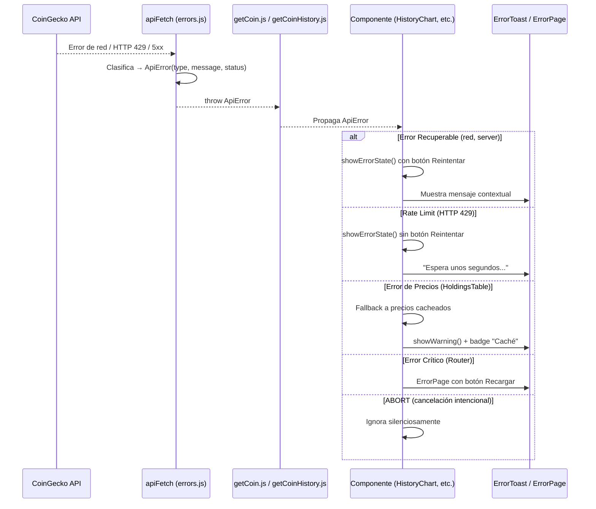

# ADR-019: Sistema de Manejo de Errores y Alertas Visuales

- **Estado:** Aceptada
- **Fecha:** 2026-05-30
- **Contexto:** La aplicación carecía de un manejo estructurado de errores de API, dejando pantallas en blanco o fallos silenciosos ante problemas de red, rate-limiting o respuestas inesperadas de CoinGecko.

## Contexto

CaletaJS consume 4 endpoints de CoinGecko en diferentes momentos del ciclo de vida de la aplicación. Antes de este cambio, cada utility (`getCoin.js`, `getCoinHistory.js`, `getExchange.js`) manejaba errores de forma aislada con patrones `try/catch` ad-hoc que principalmente logueaban a consola y retornaban valores por defecto (`[]`, `null`, `{}`).

Esto generaba varios problemas:

1. **Pantallas en blanco:** Si `buildPortfolioHistorySeries` fallaba, `HistoryChart` se quedaba en estado de carga permanente sin feedback al usuario.
2. **Fallos silenciosos:** `HoldingsTable` usaba precios cacheados sin indicar al usuario que los datos estaban desactualizados.
3. **Sin posibilidad de reintento:** El usuario no podía recuperarse de un error temporal (red intermitente, rate-limit momentáneo).
4. **Mensajes inconsistentes:** Cada componente mostraba (o no) mensajes de error con estilos y textos distintos.
5. **Sin boundary global:** Si el router fallaba al renderizar una ruta, la app quedaba en blanco sin indicación alguna.

## Decisión

Implementar un sistema de manejo de errores en 4 capas, siguiendo el principio de **fail gracefully, recover explicitly**:

### 1. Capa de Clasificación (`src/utils/errors.js`)

Clase `ApiError` tipada con 6 categorías y función `apiFetch` como wrapper sobre `fetch()`:

| Tipo | Disparador | Comportamiento |
|---|---|---|
| `NETWORK` | `TypeError` en `fetch()` (sin conexión, CORS) | Se propaga como `ApiError` |
| `RATE_LIMIT` | HTTP 429 | Se propaga; no se permite reintento inmediato |
| `NOT_FOUND` | HTTP 404 | Se propaga con mensaje descriptivo |
| `SERVER` | HTTP 5xx | Se propaga con mensaje de reintento |
| `PARSE` | `JSON.parse` falla | Se propaga como error de parseo |
| `ABORT` | `AbortController.abort()` | Se propaga; los callers lo ignoran silenciosamente |

```javascript
// apiFetch lanza ApiError tipado en cualquier escenario de fallo
const data = await apiFetch(url, options); // throws ApiError
```

**Regla:** `apiFetch` **siempre** lanza `ApiError`. El caller decide si lo ignora (ABORT), lo muestra (red, rate-limit) o lo propaga.

### 2. Capa Visual — Toasts (`src/components/ErrorToast.js`)

Sistema de notificaciones no bloqueantes con 4 variantes:

| Función | Variante | Duración por defecto | Uso |
|---|---|---|---|
| `showError()` | `error` (rojo) | 6s | Errores de API irrecuperables |
| `showWarning()` | `warning` (ámbar) | 5s | Precios cacheados, datos desactualizados |
| `showSuccess()` | `success` (verde) | 3s | Operaciones exitosas |
| `showInfo()` | `info` (azul) | 4s | Información contextual |

**Características:**
- Contenedor fijo (`#app-error-toast`, `z-index: 9999`) en esquina inferior derecha
- Animaciones `toast-in` / `toast-out` con `cubic-bezier`
- Auto-dismiss con temporizador configurable
- Protección contra doble dismiss (`dismissed` flag)
- Accesibilidad: `role="alert"`, botón de cierre con `aria-label`
- Sanitización de mensajes con `escapeHTML()`

### 3. Capa Visual — Página de Error Crítico (`src/pages/ErrorPage.js`)

Fallback global para fallos catastróficos del router:

- Muestra mensaje genérico en producción, detalle técnico en desarrollo
- Botón "Recargar" (recarga la página) y enlace "Inicio" (`#/`)
- Triple fallback: si `ErrorPage` mismo falla al renderizar, se inyecta HTML inline de emergencia

### 4. Integración en Componentes

Cada componente que consume APIs ahora tiene 3 estados explícitos: **loading → data → error**.

| Componente | Error manejado | UI de error | Reintento |
|---|---|---|---|
| `HistoryChart` | `ApiError` en `buildPortfolioHistorySeries` | Mensaje tipado con icono + botón "Reintentar" | Sí (re-ejecuta `initHistoryChart`) |
| `HoldingsTable` | `ApiError` en `fetch()` de precios | Toast `warning` + badge "Caché" en header | No (usa precios cacheados como fallback) |
| `CoinPicker` | `ApiError` en `searchCoins()` | Mensaje contextual por tipo (red/rate-limit/genérico) + botón "Reintentar" | Sí (re-ejecuta `searchInAPI`) |
| `AddAssetModal` | Precio de mercado no disponible | Toast de advertencia | No (el usuario ingresa precio manual) |
| `StatsGrid` | `usingCachedPrices: true` vía evento `prices-updated` | Etiqueta "(Caché)" en balance + barra de progreso ámbar | Automático (al resolverse la API) |

### 5. Boundary Global (`src/router/routes.js`)

Try-catch alrededor de todo el flujo de renderizado: `getHash()` → `resolveRoutes()` → `render(params)` → `init*()`.

- Si falla: renderiza `ErrorPage` en `#app`
- Si `ErrorPage` también falla: renderiza HTML de emergencia inline con botón "Recargar"

## Flujo de Errores



## Consecuencias

### Positivas
- La aplicación **nunca** queda en blanco: siempre hay feedback visual ante cualquier fallo.
- El usuario puede **reintentar** operaciones fallidas sin recargar la página completa.
- Los mensajes de error son **contextuales** y **accionables** (no genéricos).
- La clasificación tipada (`ErrorType`) evita `instanceof` checks frágiles y facilita el testeo.
- El sistema de toasts es **extensible**: añadir una nueva variante requiere solo agregar un case en `getVariantStyles()`.
- El boundary global del router protege contra fallos en cualquier punto del ciclo de renderizado.

### Negativas
- Mayor complejidad en cada componente: de 2 estados (loading/data) a 3 estados (loading/data/error).
- `apiFetch` rompe el contrato de `fetch()` (siempre lanza en error en lugar de retornar `!response.ok`). Esto es intencional pero requiere que todos los callers estén al tanto.
- Cada componente debe decidir explícitamente cómo manejar cada tipo de error, lo que añade boilerplate de `if (err.type === ErrorType.X)`.

## Relación con ADRs Existentes

- **ADR-014** (escapeHTML XSS): Los mensajes de error se sanitizan con `escapeHTML()` para prevenir XSS en datos de API.
- **ADR-018** (Rate Limit Caché): El badge "Caché" y el toast de advertencia son la primera mitigación visible del rate-limiting documentado en ADR-018.

## API Pública del Sistema de Errores

```javascript
// ── Clasificación ──
import { ApiError, ErrorType, getErrorMessage, apiFetch } from './utils/errors.js';

// Uso: siempre lanza ApiError en fallo, nunca retorna response no-ok
const data = await apiFetch(url, options);

// ── Toasts ──
import { showError, showWarning, showSuccess, showInfo } from './components/ErrorToast.js';

showError('No se pudo cargar el gráfico.', 6000);
showWarning('Mostrando precios del último guardado.', 7000);
showSuccess('Moneda agregada correctamente.', 3000);

// ── Error Page ──
import ErrorPage, { initErrorPage } from './pages/ErrorPage.js';
// Se renderiza desde el router en el catch global
```

---
*Última actualización: 2026-05-30*
