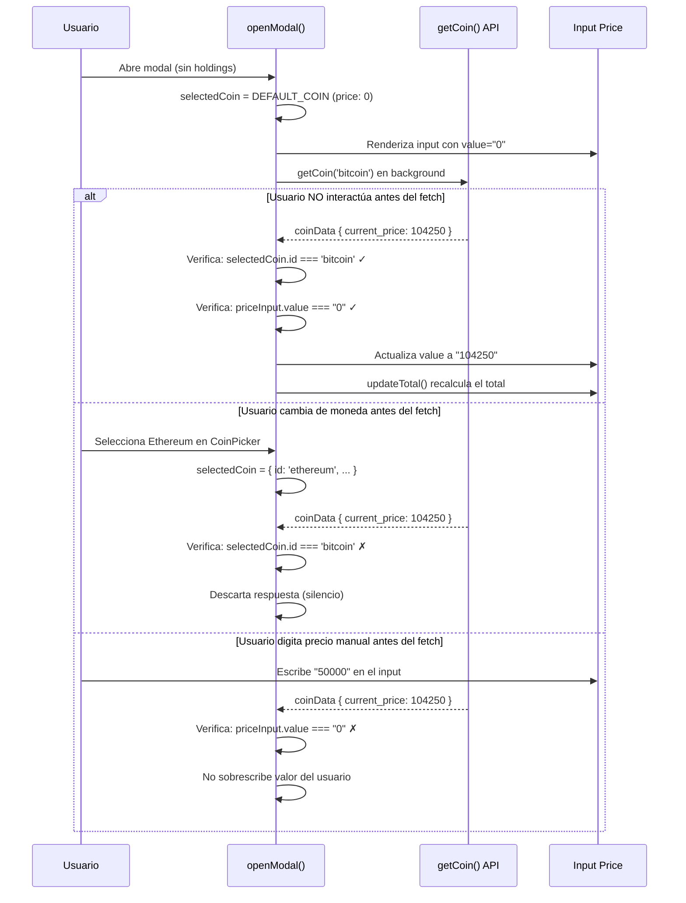
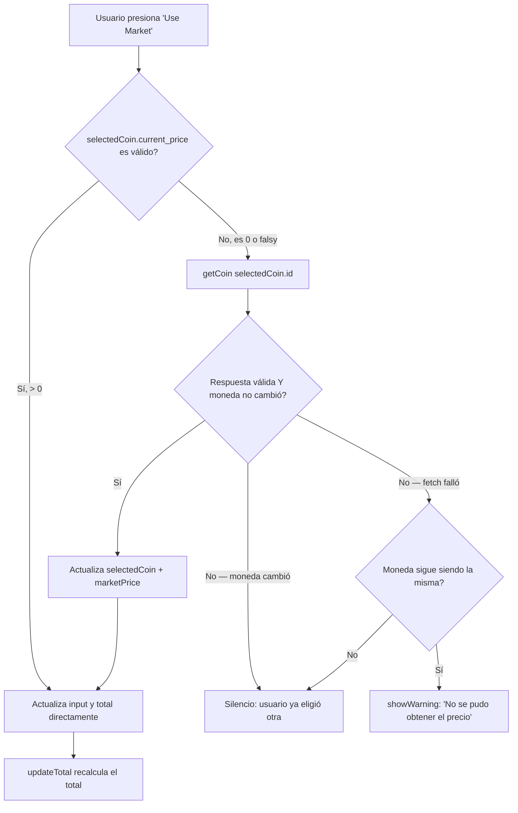

# ADR-022: Fix — Precio de Mercado Cero en Modal de Transacción sin Holdings

- **Estado:** Aceptada
- **Fecha:** 2026-06-13
- **Contexto:** Al abrir el modal "Add Transaction" sin holdings previos, el campo "Price Per Coin" mostraba `$0.00` para Bitcoin y el botón "Use Market" no corregía el valor. La causa raíz fue que `DEFAULT_COIN` se definía con `current_price: 0` y no existía ningún mecanismo para obtener el precio real desde la API en ese escenario.

## Contexto

El modal de transacciones (`AddAssetModal.js`) implementa persistencia de moneda: al abrirse, selecciona automáticamente la moneda con mayor balance entre los holdings del usuario. Esto funciona correctamente cuando ya existen transacciones registradas. Sin embargo, en el **caso de borde de primer uso** (sin holdings), el sistema recurría a `DEFAULT_COIN` (Bitcoin) cuyo `current_price` se inicializaba en `0`:

```javascript
const DEFAULT_COIN = {
  id: "bitcoin",
  symbol: "btc",
  name: "Bitcoin",
  image: "https://coin-images.coingecko.com/coins/images/1/large/bitcoin.png",
  current_price: 0  // ← Precio estático, nunca se actualiza
};
```

Esto generaba dos problemas visibles:

1. **Campo "Price Per Coin" en `$0.00`:** El input de precio se poblaba con `selectedCoin.current_price.toString()` → `"0"`, lo que confundía al usuario al mostrar un precio obviamente incorrecto para Bitcoin.
2. **Botón "Use Market" inoperante:** Al presionarlo, el handler leía `selectedCoin.current_price` (que era `0`), no tenía ruta de fetch alternativo, y simplemente no actualizaba el input ni mostraba feedback al usuario.

Adicionalmente, `updateTotal()` estaba definida como función local dentro de `wireFormView()`, lo que impedía su reutilización desde handlers asíncronos fuera de ese scope (como el fetch en background de `openModal()`).

## Decisión

Se implementaron 4 cambios coordinados en `src/components/AddAssetModal.js`:

### 1. `updateTotal()` elevada al scope del módulo

La función se extrajo de `wireFormView()` al nivel superior del módulo, haciéndola accesible desde cualquier handler asíncrono:

```javascript
// Antes: dentro de wireFormView() — solo accesible localmente
const wireFormView = () => {
  const totalDisplay = document.getElementById('total-display');
  const updateTotal = () => { /* ... */ };
  // ...
};

// Después: scope del módulo — accesible desde openModal(), handlers, etc.
const updateTotal = () => {
    const q = parseFloat(quantity) || 0;
    const p = parseFloat(price) || 0;
    const f = parseFloat(fees) || 0;
    const totalDisplay = document.getElementById('total-display');
    if (totalDisplay) {
        totalDisplay.textContent = formatUsd(q * p + f);
    }
};
```

Esto elimina la variable local `totalDisplay` y la definición duplicada que existía dentro de `wireFormView()`.

### 2. Fetch asíncrono seguro en `openModal()`

Cuando no hay holdings previos y se usa `DEFAULT_COIN`, se lanza `getCoin('bitcoin')` en segundo plano. La resolución actualiza el input solo si se cumplen todas las guardas:

```javascript
} else {
    selectedCoin = DEFAULT_COIN;
    // Fetch asíncrono seguro del precio real de Bitcoin
    getCoin('bitcoin').then(coinData => {
        // Guarda 1: El usuario no cambió de moneda mientras la petición volaba
        if (coinData?.current_price && selectedCoin.id === 'bitcoin') {
            selectedCoin = coinData;
            price = coinData.current_price.toString();
            const priceInput = document.getElementById('price-input');
            // Guarda 2: El usuario no ha digitado un valor personalizado aún
            if (priceInput && (priceInput.value === "0" || priceInput.value === "")) {
                priceInput.value = price;
                updateTotal();
            }
        }
    });
}
```

**Guardas contra race conditions:**

| Guarda | Condición | Protege contra |
|---|---|---|
| **Moneda** | `selectedCoin.id === 'bitcoin'` | Usuario abrió CoinPicker y seleccionó otra moneda antes de que el fetch retornara |
| **Input manual** | `priceInput.value === "0" \|\| priceInput.value === ""` | Usuario ya digitó un precio manualmente mientras el fetch estaba en vuelo |
| **Datos válidos** | `coinData?.current_price` | API retornó `null` o precio `0` (error de red, rate-limit, moneda inexistente) |

### 3. Botón "Use Market" con fetch de respaldo

El handler del botón "Use Market" ahora detecta si `current_price` es `0` o falsy y ejecuta un fetch asíncrono antes de renderizar el resultado. Usa `clickedCoinId` como snapshot de la moneda al momento del click:

```javascript
document.getElementById("use-market-btn")?.addEventListener("click", async () => {
    const clickedCoinId = selectedCoin.id;  // Snapshot al momento del click
    let marketPrice = selectedCoin.current_price;

    // Si el precio es 0 o no disponible, intentar fetch
    if (!marketPrice) {
        const fresh = await getCoin(clickedCoinId);
        // Guarda: el usuario no cambió de moneda durante el await
        if (selectedCoin.id === clickedCoinId && fresh?.current_price) {
            selectedCoin = fresh;
            marketPrice = fresh.current_price;
        }
    }

    // Solo actualizar si la moneda sigue siendo la misma
    if (selectedCoin.id === clickedCoinId && marketPrice) {
        price = marketPrice.toString();
        const priceInput = document.getElementById("price-input");
        if (priceInput) priceInput.value = price;
        updateTotal();
    } else if (selectedCoin.id === clickedCoinId) {
        // Mismo coin, pero el fetch falló → feedback al usuario
        showWarning("No se pudo obtener el precio de mercado actual.");
    }
    // Si selectedCoin.id !== clickedCoinId → silencio (usuario ya cambió)
});
```

### 4. Limpieza de código duplicado

Se eliminaron:
- La variable local `totalDisplay` dentro de `wireFormView()`
- La definición duplicada de `updateTotal()` que existía como closure local

## Flujo de Resolución de Precio



## Flujo del Botón "Use Market"



## Race Conditions Mitigadas

| # | Escenario | Mecanismo de protección | Resultado |
|---|---|---|---|
| 1 | **Fetch de `openModal()` tarda >5s, usuario selecciona otra moneda** | `selectedCoin.id === 'bitcoin'` se evalúa al resolver la promesa | La respuesta se descarta silenciosamente; la nueva moneda muestra su propio precio |
| 2 | **Fetch de `openModal()` tarda, usuario digita precio manual** | `priceInput.value === "0" \|\| priceInput.value === ""` verifica el estado actual del input | El valor manual del usuario se preserva; el fetch se ignora |
| 3 | **"Use Market" con precio 0, usuario cambia de moneda durante el `await`** | `clickedCoinId` captura el ID al momento del click; se compara con `selectedCoin.id` al resolver | No se sobrescribe el precio de la moneda nueva que el usuario seleccionó |
| 4 | **"Use Market" falla por red/rate-limit** | `getCoin()` retorna `null` en error (catch interno); `fresh?.current_price` evalúa falsy | Se muestra `showWarning()` solo si la moneda no cambió; silencio si cambió |
| 5 | **Doble click en "Use Market" mientras primer fetch está en vuelo** | Cada click genera su propio `clickedCoinId`; el segundo fetch es independiente | Ambos fetches compiten limpiamente; el último en resolver gana (idempotente) |

## Consecuencias

### Positivas
- **Primer uso correcto:** El usuario nuevo ve el precio real de Bitcoin inmediatamente después de que la API responde, sin necesidad de presionar "Use Market".
- **No bloquea la UI:** El fetch ocurre en background; el modal se abre instantáneamente con el valor por defecto y se actualiza cuando los datos llegan.
- **Respeta la intención del usuario:** Las guardas evitan sobrescribir valores manuales o cambios de moneda, manteniendo al usuario en control.
- **Feedback contextual:** Si "Use Market" falla, el usuario recibe un toast de advertencia (ADR-019) en lugar de un silencio confuso.
- **Código más limpio:** `updateTotal()` en scope del módulo elimina duplicación y permite su uso desde cualquier contexto asíncrono.
- **Consistente con ADR-019:** Los errores de API se manejan con `showWarning()` del sistema centralizado de toasts.

### Negativas
- **Fetch adicional en cada apertura sin holdings:** Se hace una petición extra a CoinGecko (`/coins/markets?ids=bitcoin`) cada vez que se abre el modal sin holdings. Esto contribuye al budget de rate-limit documentado en ADR-018.
- **Ventana de inconsistencia visual:** Durante los ~500-2000ms que tarda el fetch, el input muestra `$0.00`. El usuario podría ver un valor incorrecto brevemente.
- **Sin cancelación de petición:** Si el usuario cierra el modal antes de que el fetch retorne, la petición continúa en vuelo (aunque el resultado se descarta por la guarda de `selectedCoin.id`). No se usa `AbortController` en este caso específico.
- **`getCoin()` retorna `null` silenciosamente en error:** El catch interno de `getCoin()` loguea a consola pero retorna `null`, lo que impide que el caller distinga entre "moneda inexistente" y "error de red". Para este caso de uso es aceptable, pero limita el diagnóstico.

## Alternativas Consideradas

| Alternativa | Razón de descarte |
|---|---|
| **Precio estático hardcodeado en `DEFAULT_COIN`** | Se desactualiza inmediatamente; Bitcoin cambia de precio cada segundo. Cualquier valor fijo sería incorrecto. |
| **`await getCoin()` bloqueante antes de abrir el modal** | Añade latencia perceptible (~1-2s) antes de que el modal aparezca. El usuario percibiría la app como lenta. |
| **Skeleton loading en el input de precio** | Complejidad visual innecesaria para un campo que se resuelve en <2s. El valor "0" se actualiza naturalmente. |
| **AbortController para cancelar fetch al cerrar modal** | Over-engineering para este caso: el resultado se descarta de todas formas por las guardas. Añade complejidad sin beneficio tangible. |
| **Cache en memoria del precio de Bitcoin** | El precio cambia constantemente; cachearlo produciría el mismo problema que el valor estático. La API de CoinGecko ya tiene su propia capa de caché (ADR-018). |

## Relación con ADRs Existentes

- **ADR-019** (Sistema de manejo de errores): El fallback del botón "Use Market" usa `showWarning()` del sistema de toasts cuando el fetch falla. `getCoin()` internamente usa `apiFetch()` que lanza `ApiError` tipado, pero lo captura y retorna `null`, alineándose con el patrón de fail-graceful del modal.
- **ADR-018** (Rate Limit y Caché): El fetch adicional en `openModal()` consume una petición contra el rate-limit de CoinGecko. En escenarios de uso intensivo (abrir/cerrar modal repetidamente), esto podría contribuir a alcanzar el límite. Se acepta como trade-off dado que el caso de uso principal (primer inicio) es infrecuente.
- **ADR-006** (Migración a API CoinGecko): `getCoin()` usa el endpoint `/coins/markets` documentado en ADR-006. La solución no introduce nuevos endpoints.

---
*Última actualización: 2026-06-13*
