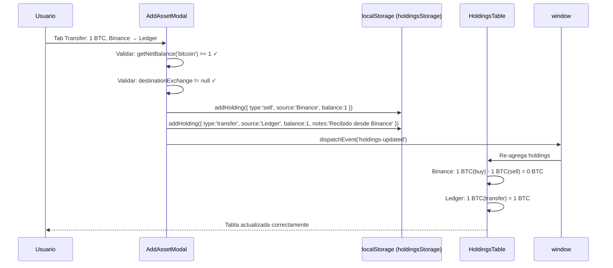

# ADR-024: Transfer — Doble Entrada Atómica (Salida + Entrada)

- **Estado:** Aceptada
- **Fecha:** 2026-06-21
- **Contexto:** El tipo de transacción `transfer` en CaletaJS se comportaba semánticamente igual que un `buy` — solo sumaba balance sin registrar el origen. Al moverse monedas entre caletas, el historial no reflejaba de dónde salieron, imposibilitando el rastreo de movimientos entre exchanges.

## Contexto

En el diseño original (documentado en el spec `temp/spec-transacciones.md`), `transfer` era una suma genérica al balance:

```
HoldingsTable.js:67
if (tx.type === 'buy' || tx.type === 'transfer') acc[key].balance += tx.balance;
```

Esto significa que "transferir 1 BTC de Binance a Ledger" producía una sola entrada:

```json
{ "type": "transfer", "source": "Binance", "balance": 1 }
```

El balance neto de BTC aumentaba en 1, como si fuera una compra. No había ningún registro de que Binance perdió ese BTC. Esto hacía que:

1. La vista de caleta "Binance" seguía mostrando el BTC como si aún estuviera allí.
2. El historial de transacciones de CoinDetails no diferenciaba entre una compra y una transferencia recibida.
3. Era posible "transferir" fondos infinitamente y aumentar el balance sin tener los activos reales.

## Decisión

El tipo `transfer` genera **dos entradas atómicas** en localStorage en el mismo handler de submit:

### Modelo de datos resultante

```json
// Salida — Caleta A pierde el activo
{
  "id": "uuid-1",
  "coinId": "bitcoin",
  "type": "sell",
  "source": "Binance",
  "balance": 1,
  "price": 104000,
  "date": "2026-06-21T20:00",
  "notes": ""
}

// Entrada — Caleta B recibe el activo
{
  "id": "uuid-2",
  "coinId": "bitcoin",
  "type": "transfer",
  "source": "Ledger",
  "balance": 1,
  "price": 104000,
  "date": "2026-06-21T20:00",
  "notes": "Recibido desde Binance"
}
```

### Lógica en el handler de submit

```javascript
if (activeTab === 'transfer') {
  const destName = destinationExchange.name;

  // Salida de Caleta A → registrada como 'sell' semántico
  addHolding({
    ...baseData,
    source: sourceName,
    type: 'sell',
    fees: parsedFees,
    notes,
  });

  // Entrada en Caleta B → registrada como 'transfer'
  addHolding({
    ...baseData,
    source: destName,
    type: 'transfer',
    fees: 0,
    notes: notes
      ? `[Recibido desde ${sourceName}] ${notes}`
      : `Recibido desde ${sourceName}`,
  });
}
```

### Efecto en la agregación de balance

Con este modelo, la lógica existente de `aggregateHoldings()` en `HoldingsTable.js` funciona correctamente **sin modificaciones**:

```
Binance:
  sell   -1 BTC  → balance Binance: 0 BTC ✓

Ledger:
  transfer +1 BTC → balance Ledger: 1 BTC ✓

Portfolio total:
  net = -1 + 1 = 0 cambio neto ✓ (correcto: solo se movió, no se creó)
```

### Flujo de datos completo



### Validaciones previas al guardado

Antes de crear las dos entradas, el handler verifica:

1. **Balance suficiente:** `getNetBalance(coinId) >= parsedQty` (cubre overselling en Transfer también).
2. **Caleta destino seleccionada:** `destinationExchange !== null`.
3. **Misma validación de cantidad/precio** que Buy y Sell.

Si alguna falla, se muestra un error inline en el formulario y no se escribe ninguna entrada.

## Consecuencias

### Positivas

- **Rastreo real de movimientos:** El historial de CoinDetails muestra exactamente de dónde salió y a dónde llegó un activo.
- **Balance por caleta correcto:** La vista filtrada por exchange en HoldingsTable refleja el estado real de cada caleta.
- **Sin cambios en `aggregateHoldings()`:** La lógica existente de suma/resta ya contempla `sell` y `transfer` correctamente. La doble entrada funciona sin refactorizar el aggregator.
- **Notas automáticas:** La entrada de destino incluye "Recibido desde [caleta]" en las notas, dando contexto inmediato en el historial.
- **Fees solo en salida:** Las fees se registran en la entrada de tipo `sell` (la que sale de la caleta), que es donde ocurre el costo real de la transacción.

### Negativas

- **Doble escritura:** Una transferencia genera 2 entradas en localStorage. Con uso intensivo, el tamaño de `caleta_holdings` crece el doble de lo esperado para transfers.
- **Eliminar una transferencia requiere borrar ambas entradas:** Si el usuario elimina desde CoinDetails la entrada `sell` de la caleta origen, la entrada `transfer` de la caleta destino queda huérfana. En el MVP, la eliminación es individual — no existe "deshacer transferencia" como operación atómica.
- **Tipo `sell` para salida puede confundir:** En el historial de la caleta origen, la salida se muestra como "Venta", aunque semánticamente sea una transferencia. Se mitiga con el campo `notes` que dice "Transferencia a Ledger" (mejora futura).
- **Sin rollback:** Si `addHolding` falla en la segunda escritura (error de storage), la primera entrada (`sell`) ya quedó guardada, dejando el portafolio en estado inconsistente. Este escenario es extremadamente improbable en localStorage pero no está manejado.

## Alternativas Consideradas

| Alternativa | Razón de descarte |
|---|---|
| **Una sola entrada con campo `destinationSource`** | Requeriría modificar `aggregateHoldings()`, `chartDataAdapter.js` y toda la lógica de filtrado por caleta. Alto impacto, bajo beneficio adicional. |
| **Tipo `transfer-out` y `transfer-in` separados** | Introduciría dos nuevos tipos que ningún componente conoce. Requeriría actualizar todos los `if (tx.type === 'buy' || tx.type === 'transfer')` del codebase. |
| **Cambiar `source` de la transacción existente (editar)** | No crea historial del movimiento. El usuario no podría ver que el BTC estuvo en Binance antes de llegar a Ledger. |
| **Tabla separada de transfers** | Arquitectura de datos completamente distinta. Incompatible con el modelo flat de `caleta_holdings` decidido en ADR-005. |

## Relación con ADRs Existentes

- **ADR-005** (Datos estáticos / localStorage): El modelo flat de `caleta_holdings` es el que permite que la doble entrada funcione sin schema adicional.
- **ADR-023** (PortfolioPicker): La validación de balance suficiente antes del Transfer depende de `getNetBalance()` de `transactionUtils.js`, introducido junto con el PortfolioPicker.
- **ADR-013** (Consolidación de datos por vistas): La lógica de filtrado por caleta en `aggregateHoldings()` produce el resultado correcto con el modelo de doble entrada sin modificaciones.

---
*Última actualización: 2026-06-21*
