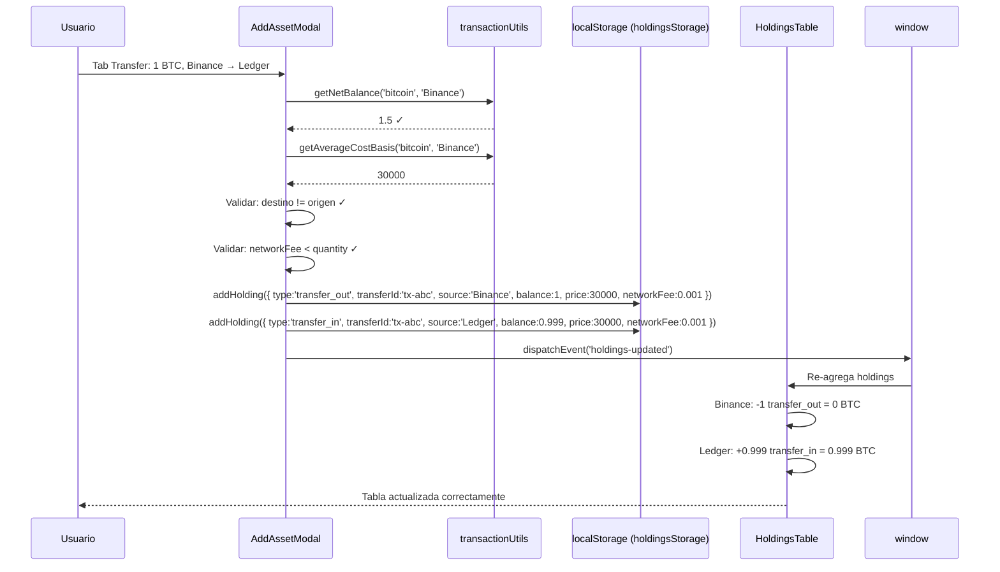

# ADR-024: Transfer — Doble Entrada con transfer_out + transfer_in

- **Estado:** Aceptada (v2 — revisión mayor)
- **Fecha:** 2026-06-21 (v1) / 2026-06-23 (v2)
- **Contexto:** El tipo de transacción `transfer` en CaletaJS se comportaba semánticamente igual que un `buy` — solo sumaba balance sin registrar el origen. La v1 resolvió esto con una doble entrada usando `sell` + `transfer`, pero introdujo problemas semánticos (transferencias contaban como ventas, cost basis se perdía). La v2 introduce tipos dedicados `transfer_out` y `transfer_in`, cost basis automático y modelo de network fee.

## Contexto

En el diseño original, `transfer` era una suma genérica al balance:

```
HoldingsTable.js:67
if (tx.type === 'buy' || tx.type === 'transfer') acc[key].balance += tx.balance;
```

Esto significaba que "transferir 1 BTC de Binance a Ledger" producía una sola entrada que solo sumaba, sin registrar la salida.

### v1 (descartada — sell + transfer)

La primera iteración modeló la salida como `type: 'sell'` y la entrada como `type: 'transfer'`. Esto funcionaba matemáticamente pero:

1. **Contaminaba stats de ventas:** `CoinDetails._renderStats()` contaba la salida como "Venta", inflando el contador.
2. **Impedía cálculo de cost basis:** La salida como `sell` realizaba una ganancia ficticia; el destino obtenía un nuevo cost basis al precio actual.
3. **Confundía al usuario:** En el historial, una transferencia saliente se mostraba como "Venta" (rojo) en vez de "Transferencia enviada" (ámbar).
4. **No modelaba network fees:** En transferencias on-chain, el fee se descuenta del balance que llega al destino.

La investigación de trackers de cripto (CoinTracker, Koinly, Blockpit, Delta) confirmó que tipar transferencias como `sell` es uno de los errores de modelado más dañinos — infla ganancias fantasmas y rompe el seguimiento de cost basis.

## Decisión (v2)

La transferencia genera **dos entradas con tipos dedicados**:

### Modelo de datos resultante

```json
// Salida — Caleta A pierde el activo (network fee deducido)
{
  "id": "uuid-1",
  "transferId": "tx-c5f8a1b2",  // UUID compartido para cascade delete (ADR-027)
  "coinId": "bitcoin",
  "type": "transfer_out",
  "source": "Binance",
  "balance": 1,
  "price": 30000,               // Cost basis heredado
  "networkFee": 0.001,          // Fee en BTC (opcional, default 0)
  "date": "2026-06-23T20:00",
  "notes": ""
}

// Entrada — Caleta B recibe el activo (balance - networkFee)
{
  "id": "uuid-2",
  "transferId": "tx-c5f8a1b2",  // Mismo UUID que transfer_out
  "coinId": "bitcoin",
  "type": "transfer_in",
  "source": "Ledger",
  "balance": 0.999,              // 1 - 0.001 = lo que realmente llega
  "price": 30000,                // Mismo cost basis per-unit
  "networkFee": 0.001,           // Referencial (el fee se pierde)
  "date": "2026-06-23T20:00",
  "notes": "Recibido desde Binance"
}
```

### Network Fee vs Platform Fee

| Tipo de fee      | Tab        | Moneda                            | Efecto en balance                       |
| ---------------- | ---------- | --------------------------------- | --------------------------------------- |
| **Platform fee** | Buy / Sell | USD (campo `fees`)                | Metadata — no toca balance de la moneda |
| **Network fee**  | Transfer   | Misma moneda (campo `networkFee`) | Reduce la cantidad que llega al destino |

En una transferencia con network fee:

- `transfer_out.balance` = cantidad que sale del source (ej. 1 BTC)
- `transfer_in.balance` = cantidad que llega al destino (balance - networkFee, ej. 0.999 BTC)
- El fee (0.001 BTC) sale del portafolio — es un gasto en la moneda transferida

Si no hay network fee (transferencia interna entre caletas sin costo on-chain):

- `networkFee` = 0
- `transfer_in.balance` = `transfer_out.balance` (entra lo mismo que sale)

### Cost Basis Automático

El precio de la transferencia **no lo ingresa el usuario**. Se calcula automáticamente como el **costo promedio ponderado** de las compras en el source:

```javascript
getAverageCostBasis(coinId, source) = sum(buy.balance * buy.price) / sum(buy.balance)
```

Este cost basis se usa como `price` en ambas entradas (`transfer_out` y `transfer_in`). Así:

- El destino hereda el cost basis real del source ✅
- Si no hay historial de compras (edge case raro), fallback al precio actual de mercado via `getCoin()`
- El usuario no ingresa precio manualmente — el campo está oculto en tab Transfer

### Lógica en el handler de submit

```javascript
if (activeTab === "transfer") {
  const destName = destinationExchange.name;
  const costBasis =
    getAverageCostBasis(coinId, sourceName) ??
    (await getCoin(coinId))?.current_price ??
    0;
  const parsedNetworkFee = parseFloat(networkFee) || 0;
  const destQuantity = parsedQty - parsedNetworkFee;
  const TRANSFER_ID = crypto.randomUUID(); // Para cascade delete (ADR-027)

  // Salida del source
  addHolding({
    coinId,
    name,
    symbol,
    logoUrl,
    balance: parsedQty,
    price: costBasis,
    source: sourceName,
    type: "transfer_out",
    transferId: TRANSFER_ID,
    networkFee: parsedNetworkFee,
    date,
    fees: 0,
    notes,
  });

  // Entrada en destino
  addHolding({
    coinId,
    name,
    symbol,
    logoUrl,
    balance: destQuantity, // parsedQty - networkFee
    price: costBasis, // mismo cost basis per-unit
    source: destName,
    type: "transfer_in",
    transferId: TRANSFER_ID,
    networkFee: parsedNetworkFee,
    date,
    fees: 0,
    notes: notes
      ? `[Recibido desde ${sourceName}] ${notes}`
      : `Recibido desde ${sourceName}`,
  });
}
```

### Efecto en la agregación de balance

`aggregateHoldings()` se actualiza para tratar `transfer_out` como resta y `transfer_in` como suma:

```
Binance:
  transfer_out  -1 BTC → balance Binance: 0 BTC ✓

Ledger:
  transfer_in +0.999 BTC → balance Ledger: 0.999 BTC ✓

Portfolio total:
  net = -1 + 0.999 = -0.001 BTC (fee de red perdido) ✓
```

### Validaciones previas al guardado

1. **Balance suficiente (por-exchange):** `getNetBalance(coinId, selectedExchange.name) >= parsedQty`. Previene overselling en la caleta específica — el usuario no puede vender/transferir desde una caleta que no tiene balance suficiente, aunque tenga la moneda en otra caleta.
2. **Caleta destino seleccionada:** `destinationExchange !== null`.
3. **Caleta destino distinta de origen:** `destinationExchange !== selectedExchange`. Impide transferencias a la misma caleta.
4. **Network fee < cantidad:** `networkFee < parsedQty`. El destino recibiría 0 o negativo, lo cual no tiene sentido.
5. **Sin validación de precio:** El campo price no se muestra en Transfer (se calcula automáticamente).

Si alguna falla, se muestra un error inline en el formulario y no se escribe ninguna entrada.

### Flujo de datos completo



## Consecuencias

### Positivas

- **Tipos semánticos correctos:** `transfer_out` no se confunde con `sell`, no infla stats de ventas, no rompe cost basis.
- **Cost basis preservado:** El destino hereda el costo promedio ponderado de la caleta origen. Las ganancias/pérdidas se calculan correctamente al vender después de una transferencia.
- **Network fee modelado correctamente:** El fee se resta de lo que llega al destino, reflejando la realidad on-chain.
- **Validación por-exchange:** Previene overselling en la caleta específica — consistente con el double-ledger de la industria (Koinly, Blockpit, Delta).
- **UX más limpia:** En tab Transfer, el usuario no ve campos irrelevantes (precio) y ve un campo relevante (network fee en la moneda, no en USD).
- **Notas automáticas:** La entrada de destino incluye "Recibido desde [caleta]" en las notas.
- **Eliminación en cascada via transferId:** Si el usuario elimina una de las dos entradas, `deleteTransaction()` detecta el `transferId` compartido y elimina ambas automáticamente (ver ADR-027). La operación es atómica desde la perspectiva del usuario.

### Negativas

- **Requiere actualizar todos los consumidores de tipos:** `aggregateHoldings()`, `getNetBalance()`, `getPortfolioCoins()`, `CoinDetails._txRow()` y `_renderStats()` deben manejar los dos nuevos tipos. Donde antes había 3 tipos (`buy`, `sell`, `transfer`), ahora hay 4 (`buy`, `sell`, `transfer_out`, `transfer_in`).
- **Doble escritura:** Una transferencia genera 2 entradas en localStorage.
- **Sin rollback:** Si `addHolding` falla en la segunda escritura, la primera ya quedó guardada. Extremadamente improbable en localStorage pero no manejado.
- **Cost basis imperfecto:** El promedio ponderado es una aproximación. El método exacto (FIFO/LIFO/HIFO por lotes) requeriría tracking individual de lotes de compra, lo cual es over-engineering para un simulador.

## Alternativas Consideradas

| Alternativa                                                  | Razón de descarte                                                                                                                                                                                         |
| ------------------------------------------------------------ | --------------------------------------------------------------------------------------------------------------------------------------------------------------------------------------------------------- |
| **Mantener v1 (sell + transfer)**                            | Contaminaba stats de ventas, rompía cost basis, no modelaba network fees. La investigación de la industria confirmó que tipar transferencias como `sell` es un error grave que infla ganancias fantasmas. |
| **Una sola entrada con campos `fromSource`/`toSource`**      | Requeriría modificar `aggregateHoldings()`, `chartDataAdapter.js` y la lógica de filtrado por caleta para que una misma transacción reste del source y sume al destino. Más complejo que dos entradas.    |
| **Transfer como evento no-contable (solo cambio de source)** | No crea historial del movimiento. El usuario no podría ver que el BTC estuvo en Binance antes de llegar a Ledger.                                                                                         |
| **Tabla separada de transfers**                              | Arquitectura de datos completamente distinta. Incompatible con el modelo flat de `caleta_holdings` (ADR-005).                                                                                             |

## Relación con ADRs Existentes

- **ADR-005** (Datos estáticos / localStorage): El modelo flat de `caleta_holdings` permite que la doble entrada funcione sin schema adicional.
- **ADR-013** (Consolidación de datos por vistas): `aggregateHoldings()` se actualiza para tratar `transfer_out` como resta y `transfer_in` como suma.
- **ADR-023** (PortfolioPicker): Recibe `sourceFilter` para mostrar balance por-exchange.
- **ADR-025** (transactionUtils): `getNetBalance()` y `getPortfolioCoins()` aceptan `sourceFilter`. Se añade `getAverageCostBasis()`.
- **ADR-027** (Transfer Linking): El campo `transferId` en ambas entradas permite eliminación en cascada. Resuelve la limitación de "eliminar requiere borrar ambas".

---

_Última actualización: 2026-06-24_
