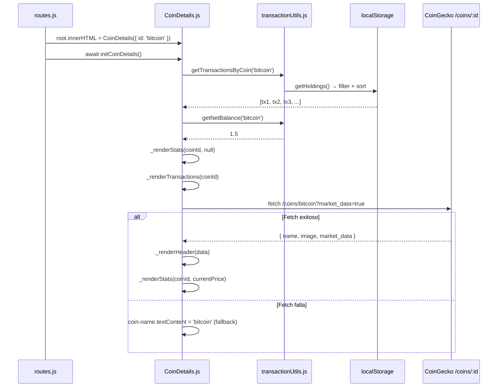

# ADR-026: CoinDetails — Página de Historial de Transacciones por Moneda

- **Estado:** Propuesta
- **Fecha:** 2026-06-20
- **Contexto:** El portafolio muestra un resumen agregado por moneda (balance total, valor en USD) pero no ofrece ninguna vista de las transacciones individuales que componen ese balance. El usuario no puede auditar su historial, verificar errores ni eliminar entradas incorrectas sin manipular directamente el localStorage.

## Contexto

`HoldingsTable.js` muestra el estado agregado del portafolio: cuántas unidades de cada moneda se tienen y cuánto valen al precio actual. Esta vista responde *qué tienes*, pero no *cómo llegaste ahí*.

Las limitaciones identificadas en el spec `temp/spec-transacciones.md`:

| Aspecto | Estado |
|---|---|
| Auditoría de transacciones | ❌ No hay vista de historial por moneda |
| Editar/eliminar transacción individual | ❌ No existe |
| Relación buy↔sell con balance visible | ❌ No se muestra en UI |

El router ya tenía la ruta `/coin/:id` registrada y `resolveRoutes.js` la resolvía correctamente, pero `CoinDetails.js` era un placeholder roto (código mezclado con un `import` dentro de un template literal).

## Decisión

Se construye la página `CoinDetails` (`src/pages/CoinDetails.js`) como una vista completa de detalle de moneda con tres secciones:

### 1. Header de la moneda (datos de CoinGecko)

Fetch asíncrono al endpoint `/coins/:id` de CoinGecko para obtener logo, precio actual y cambio 24h. Se renderiza en dos fases:

- **Fase 1 (inmediata):** Shell HTML con placeholders mientras el fetch está en vuelo.
- **Fase 2 (al resolver):** Actualización de elementos concretos via `getElementById` sin re-renderizar todo el DOM.

Si el fetch falla, se muestra el `coinId` como nombre y el header queda sin precio — la página sigue funcionando con datos locales.

### 2. Stats del holding (localStorage, sin API)

Cuatro métricas calculadas con `transactionUtils`:

| Stat | Fuente | Cálculo |
|---|---|---|
| Balance total | localStorage | `getNetBalance(coinId)` |
| Valor actual (USD) | localStorage × API | `balance × currentPrice` (si price disponible) |
| Compras + Transfers | localStorage | `count(type === 'buy' || type === 'transfer')` |
| Ventas | localStorage | `count(type === 'sell')` |

Las stats se renderizan en dos momentos: inmediatamente (sin valor en USD) y de nuevo al resolver el fetch (con valor en USD actualizado).

### 3. Historial cronológico de transacciones

Lista completa de transacciones de la moneda, de más reciente a más antigua (`getTransactionsByCoin(coinId)`). Cada fila muestra:
- Badge de tipo (Compra / Venta / Transferencia) con color semántico
- Cantidad y símbolo
- Exchange de origen · fecha · fees (si aplica)
- Notas (si existen)
- Precio por unidad al momento de la transacción
- Botón de eliminar con confirmación nativa (`confirm()`)

### Patrón de init (consistente con la arquitectura)

```javascript
// CoinDetails.js exporta dos cosas:
export default CoinDetails;          // Función pura → string HTML
export const initCoinDetails = async () => { ... }  // Event wiring + fetch
```

El router llama `await initCoinDetails()` después de `root.innerHTML = await render(params)`, igual que el resto de componentes.

### Flujo de datos



## Consecuencias

### Positivas

- **Auditoría completa:** El usuario puede ver toda la historia de una moneda — no solo el balance agregado.
- **Eliminación individual:** Primer mecanismo de corrección de datos para el usuario.
- **Sin bloqueo por API:** Las transacciones se muestran inmediatamente desde localStorage, incluso si CoinGecko falla o está rate-limited.
- **Ruta ya existe:** No se añade nueva infraestructura al router — la ruta `/coin/:id` ya estaba registrada.
- **Link desde HoldingsTable:** El nombre de cada moneda en la tabla se convierte en link a `#/coin/:id`, integración directa sin nueva UI.

### Negativas

- **Endpoint `/coins/:id` es pesado:** El endpoint de detalle de CoinGecko retorna cientos de campos. Se usan query params para reducirlo (`localization=false&tickers=false&market_data=true&community_data=false&developer_data=false`), pero sigue siendo más grande que `/coins/markets`.
- **Eliminación sin rollback:** `deleteTransaction` es irreversible. El `confirm()` nativo es la única salvaguarda. Mejora futura: usar `ConfirmDeleteModal` existente.
- **Eliminar Transfer requiere borrar ambas entradas manualmente:** Si una transferencia generó 2 entradas (ADR-024), el usuario debe eliminarlas por separado. No existe "deshacer transferencia" como operación atómica.
- **Sin paginación:** Con portafolios con cientos de transacciones de la misma moneda, la lista puede volverse larga. Se acepta en el MVP.
- **Sin edición:** Solo eliminar. Para modificar una transacción incorrecta, el usuario debe borrarla y crear una nueva.

## Alternativas Consideradas

| Alternativa | Razón de descarte |
|---|---|
| **Modal de detalle en lugar de página separada** | Un modal dentro de la página Home no tiene URL propia, no es shareable y dificulta la navegación con back/forward del browser. La ruta `/coin/:id` ya existía como placeholder. |
| **Expandir fila en HoldingsTable (accordion)** | Oculta demasiada información en un espacio pequeño. No permite mostrar el gráfico de precio histórico (mejora futura) ni las stats de la moneda. |
| **Reutilizar AddAssetModal pre-llenado para editar** | Se evaluó y descartó (ADR-023). El modal está diseñado para crear, no para editar. La lógica de "editar" requiere excluir la propia transacción del cálculo de balance. |

## Relación con ADRs Existentes

- **ADR-003** (Hash Router): La ruta `/coin/:id` usa el patrón existente `resolveRoutes.js` sin cambios.
- **ADR-006** (CoinGecko API): Se añade el endpoint `/coins/:id` a los endpoints utilizados (ver tabla en `flujo-de-datos.md`).
- **ADR-025** (transactionUtils): `CoinDetails` es el principal consumidor de la capa compartida — `getTransactionsByCoin`, `getNetBalance` y `deleteTransaction`.
- **ADR-018** (Rate Limit): El fetch de `/coins/:id` consume una petición del rate-limit al navegar a cada moneda. Se mitiga con query params restrictivos.

---
*Última actualización: 2026-06-20*
