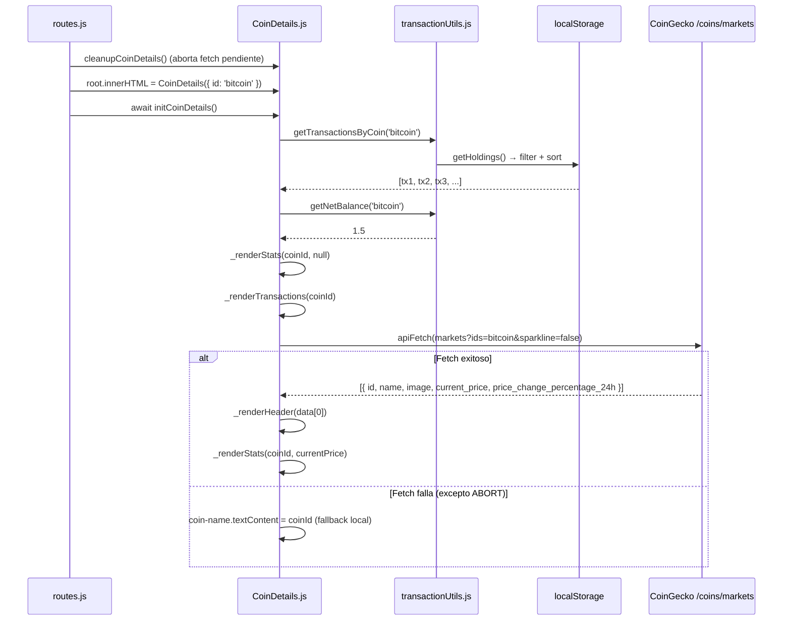

# ADR-026: CoinDetails — Página de Historial de Transacciones por Moneda

- **Estado:** Aceptada
- **Fecha:** 2026-06-20 (v1 — propuesta) / 2026-06-23 (v2 — implementación)
- **Contexto:** El portafolio muestra un resumen agregado por moneda pero no ofrece una vista de las transacciones individuales. El usuario no puede auditar su historial, verificar errores ni eliminar entradas incorrectas.

## Contexto

`HoldingsTable.js` muestra el estado agregado del portafolio: responde *qué tienes*, pero no *cómo llegaste ahí*. La v1 era un placeholder roto (código mezclado con un `import` dentro de un template literal).

### Correcciones de v2 respecto a la propuesta v1

| Aspecto | v1 (propuesta) | v2 (implementación) |
|---|---|---|
| Fetch CoinGecko | `fetch()` directo a `/coins/:id` | `apiFetch()` con `process.env.API_URL` + header API key |
| Delete | `confirm()` nativo | `openConfirmDeleteModal` (componente existente) |
| Icono delete | SVG inline hardcodeado | `#trash` del sprite |
| Stats compras | `count(type === 'buy' || type === 'transfer')` | `count(type === 'buy')` (v3: excluye transferencias) |
| Stats ventas | `count(type === 'sell')` | `count(type === 'sell') + comisiones` (v3: excluye transferencias) |
| Badge transfer_out | No existía (era `sell`) | Ámbar "Transferencia enviada" |
| Badge transfer_in | No existía (era `transfer`) | Sky "Transferencia recibida" |
| Cleanup | Sin AbortController | `cleanupCoinDetails()` con abort |
| Post-delete | Solo re-render local | También dispatch `holdings-updated` |
| Formateo | `formatCurrency` en helpers.js | `formatUsd` de formatters.js + `formatNumber` nueva en formatters.js |

## Decisión

Se construye `CoinDetails` como una vista completa con tres secciones:

### 1. Header de la moneda (datos de CoinGecko via apiFetch)

Usa `apiFetch()` (de `errors.js` — el mismo wrapper tipado que el resto de la app) al endpoint `/coins/markets?ids=...` para obtener logo, precio actual y cambio 24h. Se renderiza en dos fases:

- **Fase 1 (inmediata):** Shell HTML con placeholders mientras el fetch está en vuelo.
- **Fase 2 (al resolver):** Actualización de elementos concretos via `getElementById`, sin re-renderizar todo el DOM.

Si el fetch falla, se muestra el `coinId` como nombre y el header queda sin precio. La página sigue funcionando con datos locales.

**Endpoint usado:** `/coins/markets?vs_currency=usd&ids={coinId}` (el mismo que usa `HoldingsTable` y `getCoin.js`), no el endpoint `/coins/:id` (detalle pesado). Esto:
- Es consistente con el resto de la app.
- Retorna solo los datos necesarios: precio, cambio 24h, logo, nombre.
- Requiere menos ancho de banda que `/coins/:id`.

### 2. Stats del holding (localStorage, sin API)

Cuatro métricas calculadas con `transactionUtils`:

| Stat | Fuente | Cálculo |
|---|---|---|
| Balance total | localStorage | `getNetBalance(coinId)` |
| Valor actual (USD) | localStorage × API | `balance × currentPrice` (si precio disponible) |
| Total Entradas | localStorage | `count(type === 'buy')` (se excluyen transferencias para evitar inflar volumen) |
| Total Salidas | localStorage | `count(type === 'sell') + comisiones` (se excluyen transferencias, solo comisiones reales y de red) |

Las stats se renderizan en dos momentos: inmediatamente (sin valor en USD) y al resolver el fetch (con valor en USD actualizado).

### 3. Historial cronológico de transacciones

Lista completa de transacciones de la moneda, de más reciente a más antigua (`getTransactionsByCoin(coinId)`). Cada fila muestra:

- **Badge de tipo** con color semántico:

| Tipo | Color | Label |
|---|---|---|
| `buy` | `text-emerald-400 bg-emerald-400/10` | Compra |
| `sell` | `text-rose-400 bg-rose-400/10` | Venta |
| `transfer_out` | `text-amber-400 bg-amber-400/10` | Transferencia enviada |
| `transfer_in` | `text-sky-400 bg-sky-400/10` | Transferencia recibida |

- Cantidad y símbolo.
- Exchange de origen · fecha · fees / network fee (si aplica).
- Notas (si existen).
- Precio por unidad al momento de la transacción (o cost basis).
- Botón eliminar con `<use href="${sprite}#trash">`.

### Eliminación de transacciones

Se usa `openConfirmDeleteModal` (componente existente en `ConfirmDeleteModal.js`) en lugar de `confirm()` nativo. Esto:
- Es consistente con la tabla HoldingsTable que ya usa `openConfirmDeleteModal` para eliminar activos completos.
- Proporciona mejor UX: modal con diseño de la app en vez de popup del browser.
- Es más accesible (WCAG 2.1 AA).

```javascript
const _handleDeleteTx = (txId, coinId) => {
  openConfirmDeleteModal({
    title: 'Eliminar transacción',
    message: '¿Eliminar esta transacción? Esta acción no se puede deshacer.',
    onConfirm: () => {
      deleteTransaction(txId); // → cascada atómica (storage.set)
      _renderTransactions(coinId);
      _renderStats(coinId, null);
      window.dispatchEvent(new CustomEvent('holdings-updated'));
    }
  });
};
```

### AbortController para cleanup

`initCoinDetails` usa un `AbortController` para el fetch asíncrono. Si el usuario navega a otra ruta antes de que el fetch termine, `cleanupCoinDetails()` aborta la petición pendiente:

```javascript
let _abortController = null;

export const initCoinDetails = async () => {
  cleanupCoinDetails();
  _abortController = new AbortController();
  // Fase 1: render inmediato desde localStorage
  _renderStats(coinId, null);
  _renderTransactions(coinId);
  // Fase 2: fetch async con signal
  try {
    const data = await apiFetch(url, { signal: _abortController.signal });
    _renderHeader(data);
    _renderStats(coinId, currentPrice);
  } catch (err) {
    if (err instanceof ApiError && err.type === ErrorType.ABORT) return;
    console.warn('CoinDetails: fallo en CoinGecko —', err);
  }
};

export const cleanupCoinDetails = () => {
  if (_abortController) {
    _abortController.abort();
    _abortController = null;
  }
};
```

El router llama `cleanupCoinDetails()` antes de cada navegación (junto con los demás cleanups).

### Patrón de init (consistente con la arquitectura)

```javascript
export default CoinDetails;          // Función pura → string HTML
export const initCoinDetails = async () => { ... }
export const cleanupCoinDetails = () => { ... }
```

### Flujo de datos



## Consecuencias

### Positivas

- **Auditoría completa:** El usuario puede ver toda la historia de una moneda.
- **API consistente:** Usa `apiFetch` con manejo tipado de errores, igual que el resto de la app.
- **Delete con modal estándar:** Usa `ConfirmDeleteModal` en vez de `confirm()`, consistente con HoldingsTable.
- **Cleanup correcto:** `AbortController` previene errores al navegar durante fetch.
- **Notificaciones post-delete:** Dispatch `holdings-updated` mantiene sincronizada la HoldingsTable.
- **Sprite unificado:** Usa `#trash` del sprite en vez de SVG inline hardcodeado.
- **Stats correctas:** Se excluyen los montos de transferencia de "Total Entradas" y "Total Salidas" para evitar inflar el volumen bruto del portafolio. Las comisiones de red (`networkFee`) de las transferencias sí se acumulan en las salidas (gastos).
- **Sin bloqueo por API:** Las transacciones se muestran inmediatamente desde localStorage.
- **Link desde HoldingsTable:** El nombre de cada moneda se convierte en link a `#/coin/:id`.

### Negativas

- **Eliminación en cascada de Transfer (resuelto):** Gracias a `transferId` (ADR-027), `deleteTransaction()` detecta automáticamente la entrada emparejada y la elimina junto con la seleccionada. El usuario no tiene que borrarlas por separado.
- **Sin paginación:** Con portafolios con cientos de transacciones de la misma moneda, la lista puede ser larga. Aceptado en MVP.
- **Sin edición:** Solo eliminar. Para modificar una transacción incorrecta, el usuario debe borrarla y crear una nueva.
- **ConfirmDeleteModal ahora es transacción-aware:** Si la transacción tiene `transferId` (ADR-027), el modal muestra un mensaje contextual: "Esta transacción es parte de una transferencia. Se eliminarán ambas entradas (origen y destino)."

## Alternativas Consideradas

| Alternativa | Razón de descarte |
|---|---|
| **Modal de detalle en lugar de página separada** | No tiene URL propia, no es navegable con back/forward. |
| **Expandir fila en HoldingsTable (accordion)** | Espacio insuficiente para stats y lista cronológica. |
| **Reutilizar AddAssetModal pre-llenado para editar** | El modal está diseñado para crear, no para editar. La lógica de editar requeriría excluir la propia transacción del cálculo de balance. |

## Relación con ADRs Existentes

- **ADR-003** (Hash Router): Ruta `/coin/:id` usa el patrón existente `resolveRoutes.js`.
- **ADR-013** (Consolidación de datos): `aggregateHoldings()` en HoldingsTable y `getNetBalance()` en transactionUtils deben compartir la misma regla de suma/resta.
- **ADR-025** (transactionUtils): `CoinDetails` consume `getTransactionsByCoin`, `getNetBalance` y `deleteTransaction`.
- **ADR-024** (Transfer doble entrada): `transfer_out`/`transfer_in` tienen sus propios badges y stats dedicadas.
- **ADR-018** (Rate Limit): El fetch de `/coins/markets` consume una petición del rate-limit por navegación a una moneda.

---
*Última actualización: 2026-06-24*
